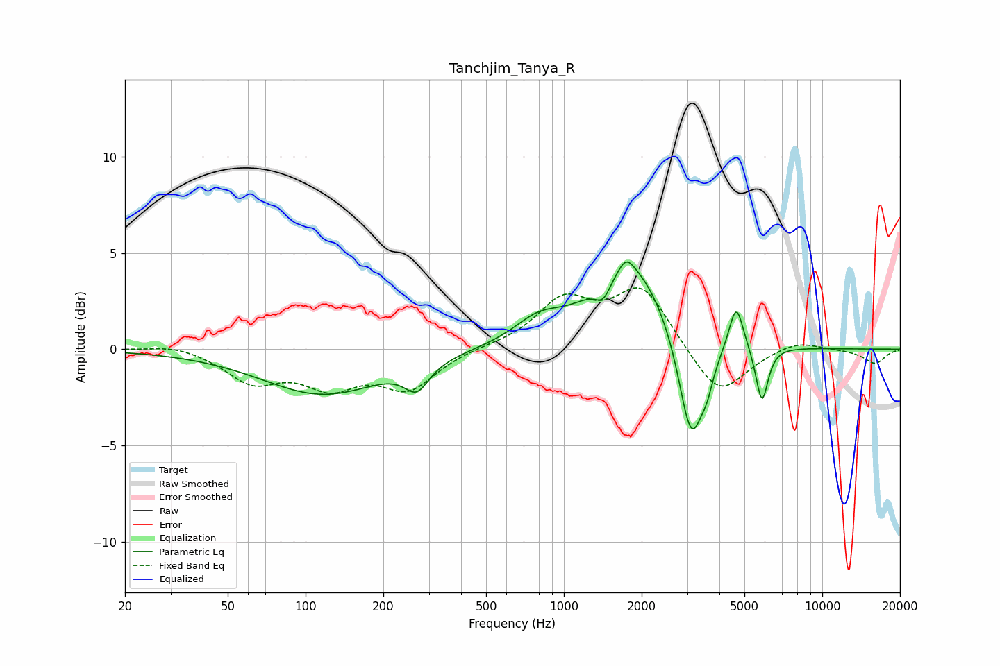

# Tanchjim_Tanya_R
See [usage instructions](https://github.com/jaakkopasanen/AutoEq#usage) for more options and info.

### Parametric EQs
Apply preamp of -4.6 dB when using parametric equalizer.

|   # | Type    |   Fc (Hz) |    Q |   Gain (dB) |
|-----|---------|-----------|------|-------------|
|   1 | Peaking |       117 | 0.6  |        -2.3 |
|   2 | Peaking |       270 | 3.01 |        -1.3 |
|   3 | Peaking |       795 | 1.5  |         1.1 |
|   4 | Peaking |      1421 | 4.51 |        -1.1 |
|   5 | Peaking |      1743 | 5.4  |         0.6 |
|   6 | Peaking |      1810 | 1    |         4.6 |
|   7 | Peaking |      3113 | 2.85 |        -5.9 |
|   8 | Peaking |      3591 | 6    |        -0.9 |
|   9 | Peaking |      4647 | 5.14 |         2.4 |
|  10 | Peaking |      5843 | 5.86 |        -3   |

### Fixed Band EQs
When using fixed band (also called graphic) equalizer, apply preamp of **-3.3 dB** (if available) and set gains manually with these parameters.

|   # | Type    |   Fc (Hz) |    Q |   Gain (dB) |
|-----|---------|-----------|------|-------------|
|   1 | Peaking |        31 | 1.41 |         0.3 |
|   2 | Peaking |        62 | 1.41 |        -1.6 |
|   3 | Peaking |       125 | 1.41 |        -1.7 |
|   4 | Peaking |       250 | 1.41 |        -1.9 |
|   5 | Peaking |       500 | 1.41 |         0.1 |
|   6 | Peaking |      1000 | 1.41 |         2.4 |
|   7 | Peaking |      2000 | 1.41 |         3.2 |
|   8 | Peaking |      4000 | 1.41 |        -2.6 |
|   9 | Peaking |      8000 | 1.41 |         0.5 |
|  10 | Peaking |     16000 | 1.41 |        -0.7 |

### Graphs

