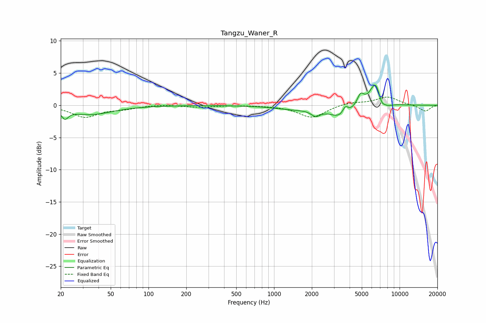

# Tangzu_Waner_R
See [usage instructions](https://github.com/jaakkopasanen/AutoEq#usage) for more options and info.

### Parametric EQs
Apply preamp of -3.2 dB when using parametric equalizer.

|   # | Type    |   Fc (Hz) |    Q |   Gain (dB) |
|-----|---------|-----------|------|-------------|
|   1 | Peaking |        22 | 5.58 |        -1.3 |
|   2 | Peaking |        34 | 0.8  |        -1.4 |
|   3 | Peaking |      1446 | 0.91 |        -0.6 |
|   4 | Peaking |      2142 | 3.95 |        -1   |
|   5 | Peaking |      3437 | 1.63 |        -1.9 |
|   6 | Peaking |      3697 | 6    |         1.3 |
|   7 | Peaking |      4887 | 4.96 |         1.8 |
|   8 | Peaking |      6470 | 2.96 |         4   |
|   9 | Peaking |      7147 | 4.69 |        -1.7 |
|  10 | Peaking |      8075 | 3.6  |        -0.5 |

### Fixed Band EQs
When using fixed band (also called graphic) equalizer, apply preamp of **-1.4 dB** (if available) and set gains manually with these parameters.

|   # | Type    |   Fc (Hz) |    Q |   Gain (dB) |
|-----|---------|-----------|------|-------------|
|   1 | Peaking |        31 | 1.41 |        -1.8 |
|   2 | Peaking |        62 | 1.41 |        -0.5 |
|   3 | Peaking |       125 | 1.41 |         0.2 |
|   4 | Peaking |       250 | 1.41 |        -0.3 |
|   5 | Peaking |       500 | 1.41 |         0   |
|   6 | Peaking |      1000 | 1.41 |        -0   |
|   7 | Peaking |      2000 | 1.41 |        -1.9 |
|   8 | Peaking |      4000 | 1.41 |         0.5 |
|   9 | Peaking |      8000 | 1.41 |         1.3 |
|  10 | Peaking |     16000 | 1.41 |        -1   |

### Graphs

