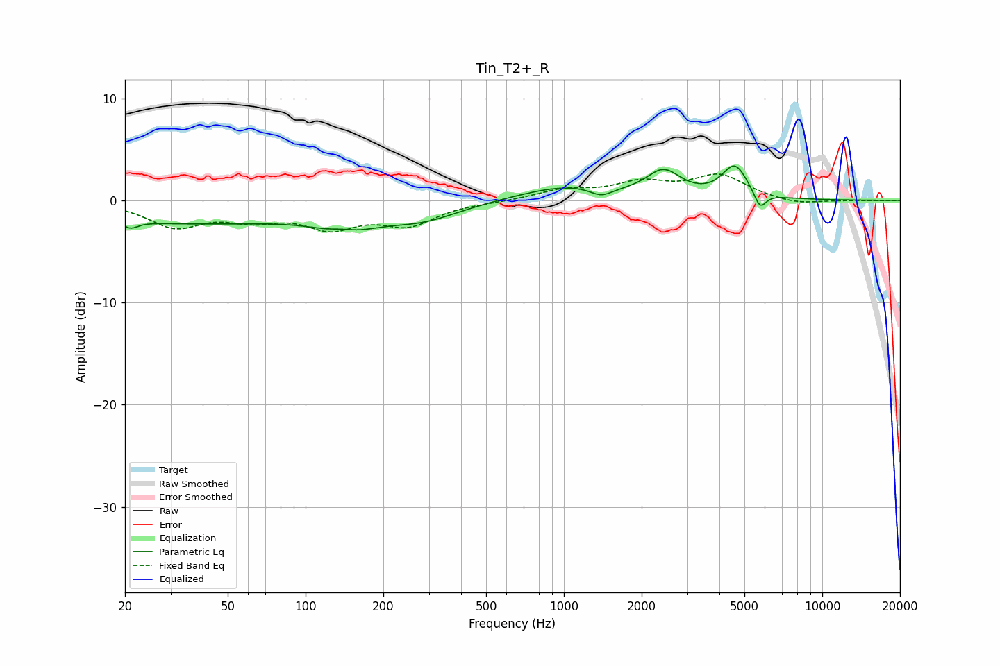

# Tin_T2+_R
See [usage instructions](https://github.com/jaakkopasanen/AutoEq#usage) for more options and info.

### Parametric EQs
Apply preamp of -3.5 dB when using parametric equalizer.

|   # | Type    |   Fc (Hz) |    Q |   Gain (dB) |
|-----|---------|-----------|------|-------------|
|   1 | Peaking |        21 | 5.15 |        -0.7 |
|   2 | Peaking |        35 | 0.28 |        -2.2 |
|   3 | Peaking |       140 | 2.15 |         1.1 |
|   4 | Peaking |       142 | 1.38 |        -2.4 |
|   5 | Peaking |       282 | 0.94 |        -1.6 |
|   6 | Peaking |      1018 | 0.79 |         1.4 |
|   7 | Peaking |      1395 | 3.34 |        -0.8 |
|   8 | Peaking |      2431 | 2.14 |         2.5 |
|   9 | Peaking |      4588 | 2.85 |         3.2 |
|  10 | Peaking |      5747 | 6    |        -1.7 |

### Fixed Band EQs
When using fixed band (also called graphic) equalizer, apply preamp of **-2.7 dB** (if available) and set gains manually with these parameters.

|   # | Type    |   Fc (Hz) |    Q |   Gain (dB) |
|-----|---------|-----------|------|-------------|
|   1 | Peaking |        31 | 1.41 |        -2.4 |
|   2 | Peaking |        62 | 1.41 |        -1.5 |
|   3 | Peaking |       125 | 1.41 |        -2.3 |
|   4 | Peaking |       250 | 1.41 |        -2.2 |
|   5 | Peaking |       500 | 1.41 |        -0.1 |
|   6 | Peaking |      1000 | 1.41 |         0.9 |
|   7 | Peaking |      2000 | 1.41 |         1.5 |
|   8 | Peaking |      4000 | 1.41 |         2.4 |
|   9 | Peaking |      8000 | 1.41 |        -0.5 |
|  10 | Peaking |     16000 | 1.41 |        -0   |

### Graphs

