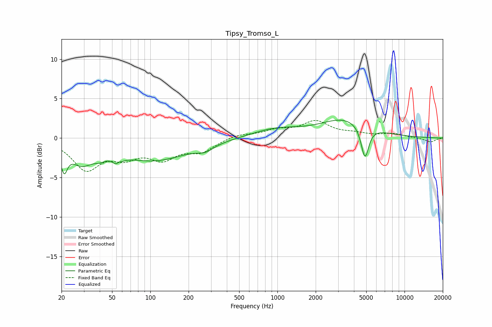

# Tipsy_Tromso_L
See [usage instructions](https://github.com/jaakkopasanen/AutoEq#usage) for more options and info.

### Parametric EQs
Apply preamp of -2.4 dB when using parametric equalizer.

|   # | Type    |   Fc (Hz) |    Q |   Gain (dB) |
|-----|---------|-----------|------|-------------|
|   1 | Peaking |        21 | 5.6  |        -2.9 |
|   2 | Peaking |        29 | 1.6  |        -2.6 |
|   3 | Peaking |        40 | 2.94 |        -0.7 |
|   4 | Peaking |        56 | 4.94 |        -2.9 |
|   5 | Peaking |        56 | 5.98 |         2.2 |
|   6 | Peaking |       106 | 0.52 |        -2.8 |
|   7 | Peaking |       272 | 2.16 |        -0.8 |
|   8 | Peaking |       974 | 0.76 |         1.1 |
|   9 | Peaking |      3404 | 0.73 |         2.3 |
|  10 | Peaking |      4881 | 4.65 |        -4.1 |

### Fixed Band EQs
When using fixed band (also called graphic) equalizer, apply preamp of **-2.3 dB** (if available) and set gains manually with these parameters.

|   # | Type    |   Fc (Hz) |    Q |   Gain (dB) |
|-----|---------|-----------|------|-------------|
|   1 | Peaking |        31 | 1.41 |        -3.8 |
|   2 | Peaking |        62 | 1.41 |        -1.9 |
|   3 | Peaking |       125 | 1.41 |        -2.3 |
|   4 | Peaking |       250 | 1.41 |        -1.5 |
|   5 | Peaking |       500 | 1.41 |         0.5 |
|   6 | Peaking |      1000 | 1.41 |         0.9 |
|   7 | Peaking |      2000 | 1.41 |         2   |
|   8 | Peaking |      4000 | 1.41 |         0.4 |
|   9 | Peaking |      8000 | 1.41 |         0.5 |
|  10 | Peaking |     16000 | 1.41 |        -0.5 |

### Graphs

