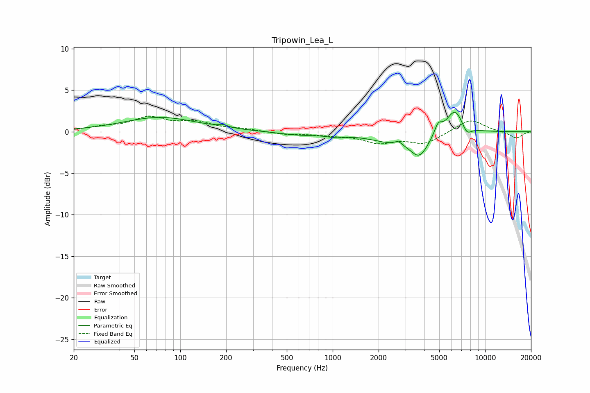

# Tripowin_Lea_L
See [usage instructions](https://github.com/jaakkopasanen/AutoEq#usage) for more options and info.

### Parametric EQs
Apply preamp of -2.4 dB when using parametric equalizer.

|   # | Type    |   Fc (Hz) |    Q |   Gain (dB) |
|-----|---------|-----------|------|-------------|
|   1 | Peaking |        74 | 0.59 |         1.7 |
|   2 | Peaking |       190 | 4.5  |         0.3 |
|   3 | Peaking |       608 | 1    |        -0.4 |
|   4 | Peaking |      1061 | 2.38 |        -0.3 |
|   5 | Peaking |      2420 | 0.97 |        -1.1 |
|   6 | Peaking |      2694 | 6    |         0.5 |
|   7 | Peaking |      3710 | 2.33 |        -2.6 |
|   8 | Peaking |      4919 | 5.57 |         1.3 |
|   9 | Peaking |      6333 | 2.48 |         2.9 |
|  10 | Peaking |      7574 | 4.4  |        -1.1 |

### Fixed Band EQs
When using fixed band (also called graphic) equalizer, apply preamp of **-2.0 dB** (if available) and set gains manually with these parameters.

|   # | Type    |   Fc (Hz) |    Q |   Gain (dB) |
|-----|---------|-----------|------|-------------|
|   1 | Peaking |        31 | 1.41 |         0.5 |
|   2 | Peaking |        62 | 1.41 |         1.6 |
|   3 | Peaking |       125 | 1.41 |         1   |
|   4 | Peaking |       250 | 1.41 |         0.3 |
|   5 | Peaking |       500 | 1.41 |        -0.3 |
|   6 | Peaking |      1000 | 1.41 |        -0.3 |
|   7 | Peaking |      2000 | 1.41 |        -1.2 |
|   8 | Peaking |      4000 | 1.41 |        -1.4 |
|   9 | Peaking |      8000 | 1.41 |         1.6 |
|  10 | Peaking |     16000 | 1.41 |        -0.8 |

### Graphs

