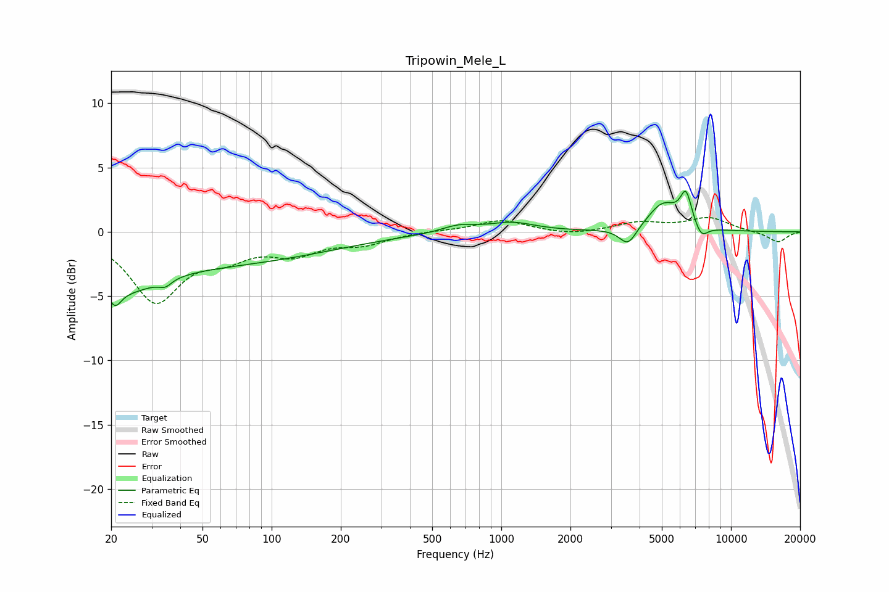

# Tripowin_Mele_L
See [usage instructions](https://github.com/jaakkopasanen/AutoEq#usage) for more options and info.

### Parametric EQs
Apply preamp of -3.2 dB when using parametric equalizer.

|   # | Type    |   Fc (Hz) |    Q |   Gain (dB) |
|-----|---------|-----------|------|-------------|
|   1 | Peaking |        21 | 5.29 |        -1.4 |
|   2 | Peaking |        23 | 1.02 |        -1.9 |
|   3 | Peaking |        34 | 5.11 |        -0.5 |
|   4 | Peaking |        35 | 0.18 |        -2.6 |
|   5 | Peaking |       650 | 1.9  |         0.5 |
|   6 | Peaking |      1109 | 1.4  |         0.7 |
|   7 | Peaking |      3565 | 3.74 |        -1.4 |
|   8 | Peaking |      5061 | 2.07 |         2.2 |
|   9 | Peaking |      6371 | 5.48 |         2.4 |
|  10 | Peaking |      7426 | 4.71 |        -1   |

### Fixed Band EQs
When using fixed band (also called graphic) equalizer, apply preamp of **-1.2 dB** (if available) and set gains manually with these parameters.

|   # | Type    |   Fc (Hz) |    Q |   Gain (dB) |
|-----|---------|-----------|------|-------------|
|   1 | Peaking |        31 | 1.41 |        -5.2 |
|   2 | Peaking |        62 | 1.41 |        -1.5 |
|   3 | Peaking |       125 | 1.41 |        -1.5 |
|   4 | Peaking |       250 | 1.41 |        -0.8 |
|   5 | Peaking |       500 | 1.41 |         0.1 |
|   6 | Peaking |      1000 | 1.41 |         0.9 |
|   7 | Peaking |      2000 | 1.41 |        -0.3 |
|   8 | Peaking |      4000 | 1.41 |         0.7 |
|   9 | Peaking |      8000 | 1.41 |         1.1 |
|  10 | Peaking |     16000 | 1.41 |        -0.8 |

### Graphs

