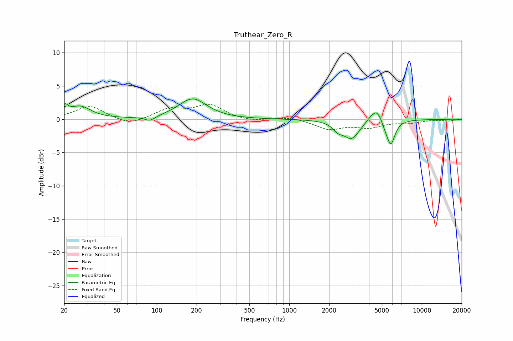

# Truthear_Zero_R
See [usage instructions](https://github.com/jaakkopasanen/AutoEq#usage) for more options and info.

### Parametric EQs
Apply preamp of -3.2 dB when using parametric equalizer.

|   # | Type    |   Fc (Hz) |    Q |   Gain (dB) |
|-----|---------|-----------|------|-------------|
|   1 | Peaking |        20 | 5.96 |         1.3 |
|   2 | Peaking |        26 | 1.77 |         1.8 |
|   3 | Peaking |        89 | 3.46 |        -0.7 |
|   4 | Peaking |       186 | 1.33 |         3.1 |
|   5 | Peaking |      2330 | 3.76 |        -1   |
|   6 | Peaking |      2956 | 2.31 |        -2.8 |
|   7 | Peaking |      4144 | 3.17 |         0.5 |
|   8 | Peaking |      4629 | 3.18 |         2.1 |
|   9 | Peaking |      5268 | 3.34 |        -1.1 |
|  10 | Peaking |      5842 | 4.51 |        -3.5 |

### Fixed Band EQs
When using fixed band (also called graphic) equalizer, apply preamp of **-2.4 dB** (if available) and set gains manually with these parameters.

|   # | Type    |   Fc (Hz) |    Q |   Gain (dB) |
|-----|---------|-----------|------|-------------|
|   1 | Peaking |        31 | 1.41 |         2   |
|   2 | Peaking |        62 | 1.41 |        -1   |
|   3 | Peaking |       125 | 1.41 |         1.4 |
|   4 | Peaking |       250 | 1.41 |         2.1 |
|   5 | Peaking |       500 | 1.41 |        -0.4 |
|   6 | Peaking |      1000 | 1.41 |         0.4 |
|   7 | Peaking |      2000 | 1.41 |        -1.4 |
|   8 | Peaking |      4000 | 1.41 |        -1.1 |
|   9 | Peaking |      8000 | 1.41 |        -0.5 |
|  10 | Peaking |     16000 | 1.41 |        -0.2 |

### Graphs

