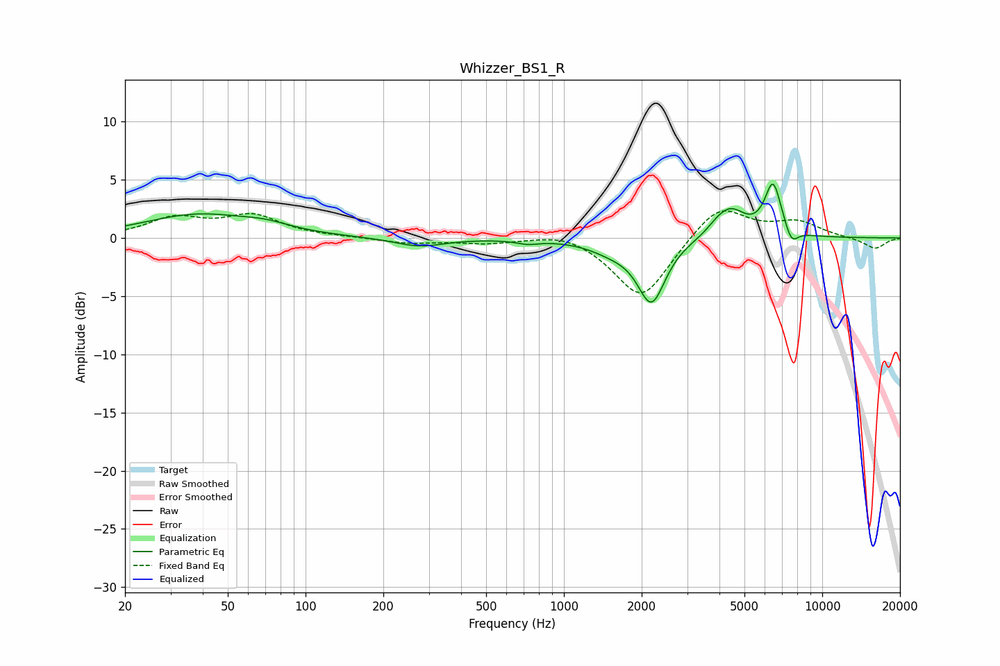

# Whizzer_BS1_R
See [usage instructions](https://github.com/jaakkopasanen/AutoEq#usage) for more options and info.

### Parametric EQs
Apply preamp of -4.7 dB when using parametric equalizer.

|   # | Type    |   Fc (Hz) |    Q |   Gain (dB) |
|-----|---------|-----------|------|-------------|
|   1 | Peaking |        38 | 0.69 |         1.9 |
|   2 | Peaking |        70 | 1.43 |         0.6 |
|   3 | Peaking |       276 | 1.48 |        -0.8 |
|   4 | Peaking |       723 | 3.32 |        -0.3 |
|   5 | Peaking |      1536 | 1.61 |        -0.8 |
|   6 | Peaking |      2183 | 2.63 |        -5.4 |
|   7 | Peaking |      3901 | 3.74 |         0.4 |
|   8 | Peaking |      4409 | 2.36 |         2.4 |
|   9 | Peaking |      6453 | 4.21 |         4.5 |
|  10 | Peaking |      7601 | 5.38 |        -1.4 |

### Fixed Band EQs
When using fixed band (also called graphic) equalizer, apply preamp of **-2.4 dB** (if available) and set gains manually with these parameters.

|   # | Type    |   Fc (Hz) |    Q |   Gain (dB) |
|-----|---------|-----------|------|-------------|
|   1 | Peaking |        31 | 1.41 |         1.6 |
|   2 | Peaking |        62 | 1.41 |         1.8 |
|   3 | Peaking |       125 | 1.41 |         0.1 |
|   4 | Peaking |       250 | 1.41 |        -0.4 |
|   5 | Peaking |       500 | 1.41 |        -0.4 |
|   6 | Peaking |      1000 | 1.41 |         0.7 |
|   7 | Peaking |      2000 | 1.41 |        -5.4 |
|   8 | Peaking |      4000 | 1.41 |         3   |
|   9 | Peaking |      8000 | 1.41 |         1.3 |
|  10 | Peaking |     16000 | 1.41 |        -1   |

### Graphs

