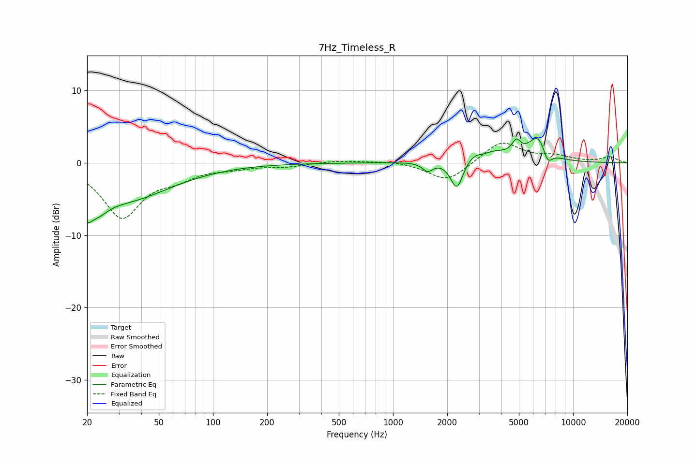

# 7Hz_Timeless_R
See [usage instructions](https://github.com/jaakkopasanen/AutoEq#usage) for more options and info.

### Parametric EQs
Apply preamp of -3.5 dB when using parametric equalizer.

|   # | Type    |   Fc (Hz) |    Q |   Gain (dB) |
|-----|---------|-----------|------|-------------|
|   1 | Peaking |        20 | 5.09 |        -2.6 |
|   2 | Peaking |        23 | 2.5  |        -2.3 |
|   3 | Peaking |        32 | 0.54 |        -5   |
|   4 | Peaking |      1556 | 4.99 |        -1.2 |
|   5 | Peaking |      2263 | 3.92 |        -4.4 |
|   6 | Peaking |      3109 | 1.35 |         2.3 |
|   7 | Peaking |      3203 | 3.4  |        -0.8 |
|   8 | Peaking |      4840 | 5.9  |         1.7 |
|   9 | Peaking |      6421 | 2.55 |         3.5 |
|  10 | Peaking |      7215 | 5.16 |        -2.1 |

### Fixed Band EQs
When using fixed band (also called graphic) equalizer, apply preamp of **-2.8 dB** (if available) and set gains manually with these parameters.

|   # | Type    |   Fc (Hz) |    Q |   Gain (dB) |
|-----|---------|-----------|------|-------------|
|   1 | Peaking |        31 | 1.41 |        -7.4 |
|   2 | Peaking |        62 | 1.41 |        -1.6 |
|   3 | Peaking |       125 | 1.41 |        -0.6 |
|   4 | Peaking |       250 | 1.41 |        -0.5 |
|   5 | Peaking |       500 | 1.41 |         0.3 |
|   6 | Peaking |      1000 | 1.41 |         0.3 |
|   7 | Peaking |      2000 | 1.41 |        -2.7 |
|   8 | Peaking |      4000 | 1.41 |         3   |
|   9 | Peaking |      8000 | 1.41 |         0.8 |
|  10 | Peaking |     16000 | 1.41 |         0.8 |

### Graphs

