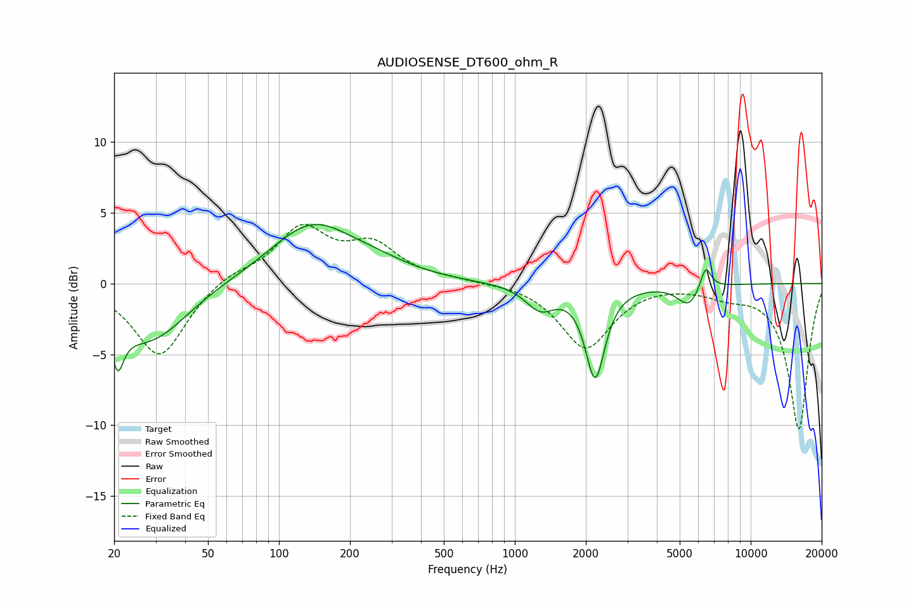

# AUDIOSENSE_DT600_ohm_R
See [usage instructions](https://github.com/jaakkopasanen/AutoEq#usage) for more options and info.

### Parametric EQs
Apply preamp of -4.3 dB when using parametric equalizer.

|   # | Type    |   Fc (Hz) |    Q |   Gain (dB) |
|-----|---------|-----------|------|-------------|
|   1 | Peaking |        21 | 5.8  |        -4.2 |
|   2 | Peaking |        21 | 6    |         1.3 |
|   3 | Peaking |        22 | 1.15 |        -1.4 |
|   4 | Peaking |        30 | 0.95 |        -3.1 |
|   5 | Peaking |       138 | 0.81 |         4.1 |
|   6 | Peaking |       259 | 0.93 |         0.7 |
|   7 | Peaking |      1280 | 2.29 |        -1.7 |
|   8 | Peaking |      2190 | 3.44 |        -6.4 |
|   9 | Peaking |      5460 | 2.96 |        -1.5 |
|  10 | Peaking |      6447 | 6    |         1.7 |

### Fixed Band EQs
When using fixed band (also called graphic) equalizer, apply preamp of **-4.3 dB** (if available) and set gains manually with these parameters.

|   # | Type    |   Fc (Hz) |    Q |   Gain (dB) |
|-----|---------|-----------|------|-------------|
|   1 | Peaking |        31 | 1.41 |        -5.2 |
|   2 | Peaking |        62 | 1.41 |         0.7 |
|   3 | Peaking |       125 | 1.41 |         3.8 |
|   4 | Peaking |       250 | 1.41 |         2.5 |
|   5 | Peaking |       500 | 1.41 |         0.2 |
|   6 | Peaking |      1000 | 1.41 |         0.1 |
|   7 | Peaking |      2000 | 1.41 |        -4.6 |
|   8 | Peaking |      4000 | 1.41 |         0.1 |
|   9 | Peaking |      8000 | 1.41 |        -0.6 |
|  10 | Peaking |     16000 | 1.41 |       -10.3 |

### Graphs

