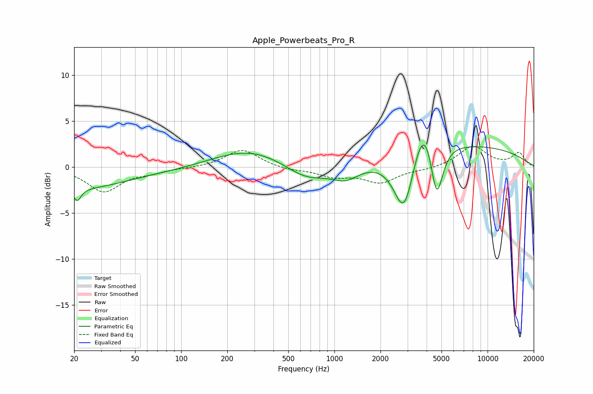

# Apple_Powerbeats_Pro_R
See [usage instructions](https://github.com/jaakkopasanen/AutoEq#usage) for more options and info.

### Parametric EQs
Apply preamp of -2.5 dB when using parametric equalizer.

|   # | Type    |   Fc (Hz) |    Q |   Gain (dB) |
|-----|---------|-----------|------|-------------|
|   1 | Peaking |        20 | 0.4  |        -2.3 |
|   2 | Peaking |        21 | 6    |        -1.3 |
|   3 | Peaking |       146 | 0.49 |        -0.4 |
|   4 | Peaking |       275 | 0.54 |         2.3 |
|   5 | Peaking |       653 | 0.95 |        -1.9 |
|   6 | Peaking |      1190 | 1.61 |        -1.4 |
|   7 | Peaking |      2859 | 2.05 |        -7.3 |
|   8 | Peaking |      3884 | 1.77 |         5.9 |
|   9 | Peaking |      4641 | 3.24 |        -7.2 |
|  10 | Peaking |      6766 | 0.27 |         2.3 |

### Fixed Band EQs
When using fixed band (also called graphic) equalizer, apply preamp of **-2.4 dB** (if available) and set gains manually with these parameters.

|   # | Type    |   Fc (Hz) |    Q |   Gain (dB) |
|-----|---------|-----------|------|-------------|
|   1 | Peaking |        31 | 1.41 |        -2.6 |
|   2 | Peaking |        62 | 1.41 |        -0.5 |
|   3 | Peaking |       125 | 1.41 |        -0.1 |
|   4 | Peaking |       250 | 1.41 |         1.9 |
|   5 | Peaking |       500 | 1.41 |        -0.3 |
|   6 | Peaking |      1000 | 1.41 |        -0.9 |
|   7 | Peaking |      2000 | 1.41 |        -1.6 |
|   8 | Peaking |      4000 | 1.41 |        -0.2 |
|   9 | Peaking |      8000 | 1.41 |         2.3 |
|  10 | Peaking |     16000 | 1.41 |         1.5 |

### Graphs

