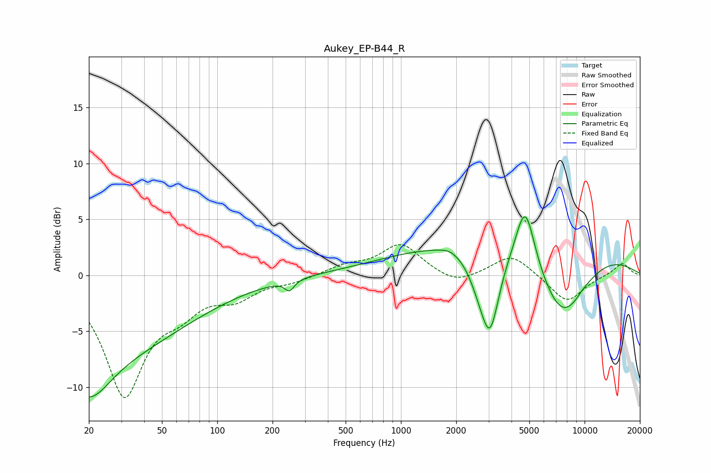

# Aukey_EP-B44_R
See [usage instructions](https://github.com/jaakkopasanen/AutoEq#usage) for more options and info.

### Parametric EQs
Apply preamp of -5.3 dB when using parametric equalizer.

|   # | Type    |   Fc (Hz) |    Q |   Gain (dB) |
|-----|---------|-----------|------|-------------|
|   1 | Peaking |        20 | 0.26 |        -7   |
|   2 | Peaking |        20 | 1.24 |        -3.9 |
|   3 | Peaking |       247 | 5.6  |        -0.9 |
|   4 | Peaking |      1850 | 2.71 |         0.4 |
|   5 | Peaking |      2671 | 2.44 |        -1.8 |
|   6 | Peaking |      3059 | 2.82 |        -6.6 |
|   7 | Peaking |      4521 | 0.18 |         3.5 |
|   8 | Peaking |      4749 | 2.64 |         5.8 |
|   9 | Peaking |      7571 | 0.96 |        -6.6 |
|  10 | Peaking |      9796 | 4.35 |         0.1 |

### Fixed Band EQs
When using fixed band (also called graphic) equalizer, apply preamp of **-2.8 dB** (if available) and set gains manually with these parameters.

|   # | Type    |   Fc (Hz) |    Q |   Gain (dB) |
|-----|---------|-----------|------|-------------|
|   1 | Peaking |        31 | 1.41 |       -10.5 |
|   2 | Peaking |        62 | 1.41 |        -2.2 |
|   3 | Peaking |       125 | 1.41 |        -1.7 |
|   4 | Peaking |       250 | 1.41 |        -0.5 |
|   5 | Peaking |       500 | 1.41 |         0.8 |
|   6 | Peaking |      1000 | 1.41 |         2.8 |
|   7 | Peaking |      2000 | 1.41 |        -0.9 |
|   8 | Peaking |      4000 | 1.41 |         1.9 |
|   9 | Peaking |      8000 | 1.41 |        -2.5 |
|  10 | Peaking |     16000 | 1.41 |         1.1 |

### Graphs

