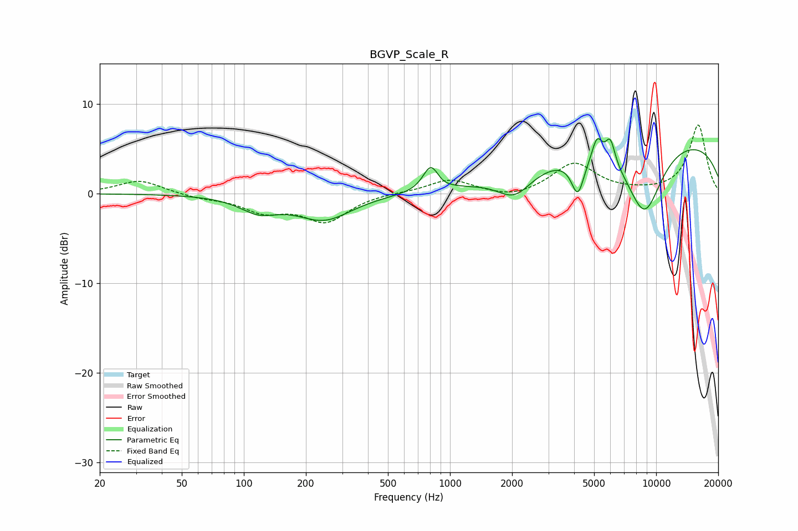

# BGVP_Scale_R
See [usage instructions](https://github.com/jaakkopasanen/AutoEq#usage) for more options and info.

### Parametric EQs
Apply preamp of -6.3 dB when using parametric equalizer.

|   # | Type    |   Fc (Hz) |    Q |   Gain (dB) |
|-----|---------|-----------|------|-------------|
|   1 | Peaking |       118 | 1.51 |        -1.7 |
|   2 | Peaking |       245 | 1.06 |        -2.8 |
|   3 | Peaking |       806 | 3.81 |         2.7 |
|   4 | Peaking |       936 | 6    |        -0.1 |
|   5 | Peaking |      2055 | 1.71 |        -2.6 |
|   6 | Peaking |      4168 | 4.53 |        -4   |
|   7 | Peaking |      5169 | 5.57 |         2.6 |
|   8 | Peaking |      5993 | 5.91 |         2.8 |
|   9 | Peaking |      8769 | 1.43 |        -8.2 |
|  10 | Peaking |     10000 | 0.2  |         6.5 |

### Fixed Band EQs
When using fixed band (also called graphic) equalizer, apply preamp of **-7.7 dB** (if available) and set gains manually with these parameters.

|   # | Type    |   Fc (Hz) |    Q |   Gain (dB) |
|-----|---------|-----------|------|-------------|
|   1 | Peaking |        31 | 1.41 |         1.5 |
|   2 | Peaking |        62 | 1.41 |        -0.4 |
|   3 | Peaking |       125 | 1.41 |        -1.8 |
|   4 | Peaking |       250 | 1.41 |        -3   |
|   5 | Peaking |       500 | 1.41 |         0.1 |
|   6 | Peaking |      1000 | 1.41 |         1.6 |
|   7 | Peaking |      2000 | 1.41 |        -0.7 |
|   8 | Peaking |      4000 | 1.41 |         3.4 |
|   9 | Peaking |      8000 | 1.41 |         0.1 |
|  10 | Peaking |     16000 | 1.41 |         7.7 |

### Graphs

