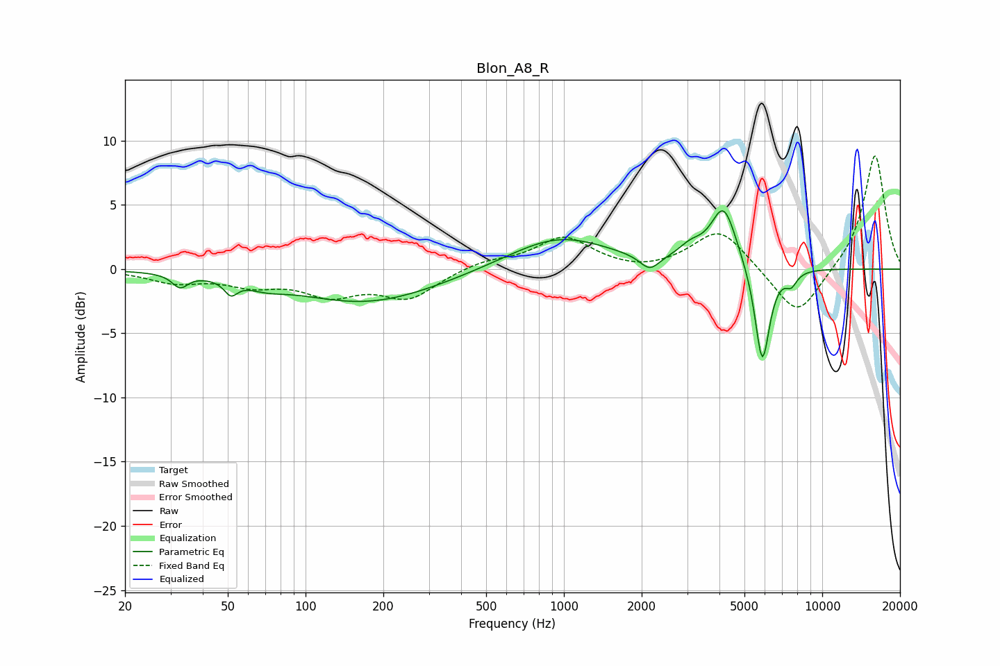

# Blon_A8_R
See [usage instructions](https://github.com/jaakkopasanen/AutoEq#usage) for more options and info.

### Parametric EQs
Apply preamp of -4.6 dB when using parametric equalizer.

|   # | Type    |   Fc (Hz) |    Q |   Gain (dB) |
|-----|---------|-----------|------|-------------|
|   1 | Peaking |        33 | 4.84 |        -1   |
|   2 | Peaking |        51 | 5.75 |        -1.1 |
|   3 | Peaking |        70 | 1.9  |        -0.5 |
|   4 | Peaking |       172 | 0.5  |        -2.6 |
|   5 | Peaking |       958 | 0.72 |         2.6 |
|   6 | Peaking |      2148 | 3.77 |        -1.1 |
|   7 | Peaking |      3093 | 2.89 |         1   |
|   8 | Peaking |      4156 | 2.79 |         4.7 |
|   9 | Peaking |      5861 | 4.79 |        -7.8 |
|  10 | Peaking |      7587 | 6    |        -1   |

### Fixed Band EQs
When using fixed band (also called graphic) equalizer, apply preamp of **-8.9 dB** (if available) and set gains manually with these parameters.

|   # | Type    |   Fc (Hz) |    Q |   Gain (dB) |
|-----|---------|-----------|------|-------------|
|   1 | Peaking |        31 | 1.41 |        -0.9 |
|   2 | Peaking |        62 | 1.41 |        -1.1 |
|   3 | Peaking |       125 | 1.41 |        -1.8 |
|   4 | Peaking |       250 | 1.41 |        -2.2 |
|   5 | Peaking |       500 | 1.41 |         0.6 |
|   6 | Peaking |      1000 | 1.41 |         2.4 |
|   7 | Peaking |      2000 | 1.41 |        -0.3 |
|   8 | Peaking |      4000 | 1.41 |         3.2 |
|   9 | Peaking |      8000 | 1.41 |        -3.9 |
|  10 | Peaking |     16000 | 1.41 |         9   |

### Graphs

