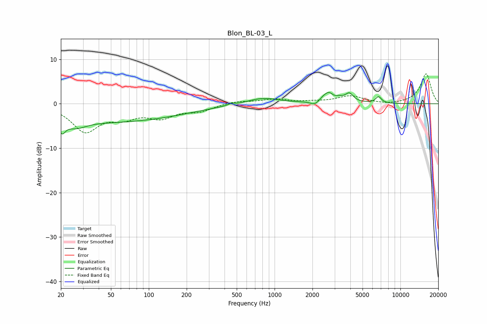

# Blon_BL-03_L
See [usage instructions](https://github.com/jaakkopasanen/AutoEq#usage) for more options and info.

### Parametric EQs
Apply preamp of -2.6 dB when using parametric equalizer.

|   # | Type    |   Fc (Hz) |    Q |   Gain (dB) |
|-----|---------|-----------|------|-------------|
|   1 | Peaking |        20 | 5.47 |        -2.6 |
|   2 | Peaking |        26 | 1.77 |        -1.7 |
|   3 | Peaking |        49 | 0.23 |        -4   |
|   4 | Peaking |       453 | 5.98 |         0.4 |
|   5 | Peaking |       805 | 1.16 |         1.4 |
|   6 | Peaking |      2099 | 3.74 |        -1.2 |
|   7 | Peaking |      2758 | 2.21 |         3.1 |
|   8 | Peaking |      2955 | 5.77 |        -0.9 |
|   9 | Peaking |      3937 | 4.75 |         1.7 |
|  10 | Peaking |      6701 | 6    |         1.4 |

### Fixed Band EQs
When using fixed band (also called graphic) equalizer, apply preamp of **-6.8 dB** (if available) and set gains manually with these parameters.

|   # | Type    |   Fc (Hz) |    Q |   Gain (dB) |
|-----|---------|-----------|------|-------------|
|   1 | Peaking |        31 | 1.41 |        -6   |
|   2 | Peaking |        62 | 1.41 |        -2.5 |
|   3 | Peaking |       125 | 1.41 |        -2.7 |
|   4 | Peaking |       250 | 1.41 |        -1.5 |
|   5 | Peaking |       500 | 1.41 |         0.6 |
|   6 | Peaking |      1000 | 1.41 |         1   |
|   7 | Peaking |      2000 | 1.41 |         0.3 |
|   8 | Peaking |      4000 | 1.41 |         1.7 |
|   9 | Peaking |      8000 | 1.41 |        -0.3 |
|  10 | Peaking |     16000 | 1.41 |         6.8 |

### Graphs

