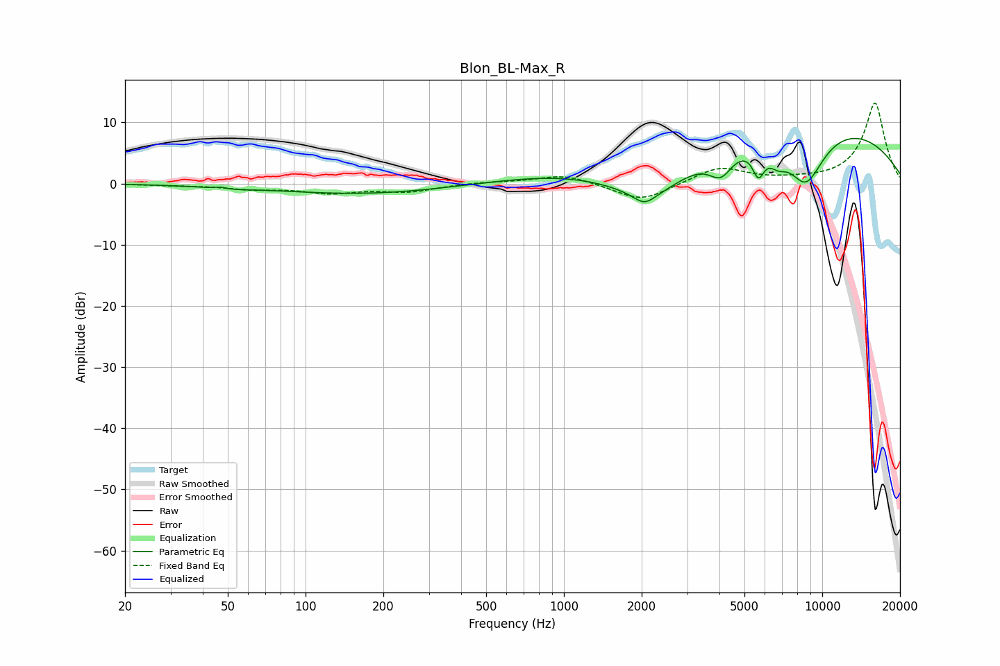

# Blon_BL-Max_R
See [usage instructions](https://github.com/jaakkopasanen/AutoEq#usage) for more options and info.

### Parametric EQs
Apply preamp of -7.5 dB when using parametric equalizer.

|   # | Type    |   Fc (Hz) |    Q |   Gain (dB) |
|-----|---------|-----------|------|-------------|
|   1 | Peaking |        47 | 5.67 |         0.3 |
|   2 | Peaking |        49 | 1.89 |        -0.4 |
|   3 | Peaking |       170 | 0.42 |        -1.7 |
|   4 | Peaking |      2050 | 3.53 |        -1.8 |
|   5 | Peaking |      2221 | 0.68 |       -10.6 |
|   6 | Peaking |      4053 | 2.93 |        -4.1 |
|   7 | Peaking |      5661 | 5.9  |        -4.3 |
|   8 | Peaking |      5890 | 0.19 |        12.8 |
|   9 | Peaking |      6727 | 3.72 |        -2.3 |
|  10 | Peaking |      8626 | 1.6  |       -10   |

### Fixed Band EQs
When using fixed band (also called graphic) equalizer, apply preamp of **-13.3 dB** (if available) and set gains manually with these parameters.

|   # | Type    |   Fc (Hz) |    Q |   Gain (dB) |
|-----|---------|-----------|------|-------------|
|   1 | Peaking |        31 | 1.41 |        -0.2 |
|   2 | Peaking |        62 | 1.41 |        -0.8 |
|   3 | Peaking |       125 | 1.41 |        -1.4 |
|   4 | Peaking |       250 | 1.41 |        -1.2 |
|   5 | Peaking |       500 | 1.41 |         0.3 |
|   6 | Peaking |      1000 | 1.41 |         1.5 |
|   7 | Peaking |      2000 | 1.41 |        -3   |
|   8 | Peaking |      4000 | 1.41 |         2.7 |
|   9 | Peaking |      8000 | 1.41 |         0.3 |
|  10 | Peaking |     16000 | 1.41 |        13.2 |

### Graphs

