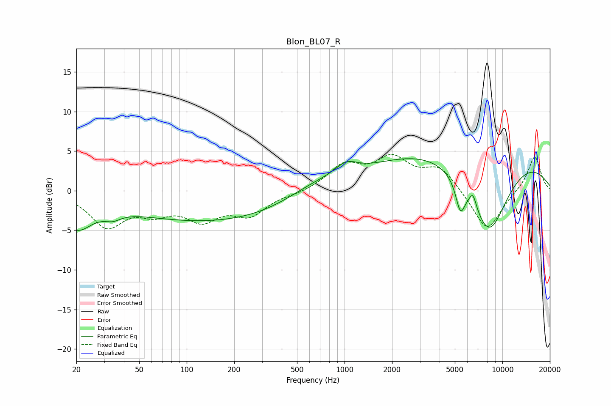

# Blon_BL07_R
See [usage instructions](https://github.com/jaakkopasanen/AutoEq#usage) for more options and info.

### Parametric EQs
Apply preamp of -4.1 dB when using parametric equalizer.

|   # | Type    |   Fc (Hz) |    Q |   Gain (dB) |
|-----|---------|-----------|------|-------------|
|   1 | Peaking |        20 | 1.42 |        -4   |
|   2 | Peaking |        34 | 2.72 |        -1   |
|   3 | Peaking |        36 | 3.09 |         0.2 |
|   4 | Peaking |       153 | 0.24 |        -3.9 |
|   5 | Peaking |       646 | 0.71 |         1.8 |
|   6 | Peaking |      1030 | 2.06 |         1.5 |
|   7 | Peaking |      5419 | 4.7  |        -3.6 |
|   8 | Peaking |      6507 | 6    |         1.8 |
|   9 | Peaking |      6554 | 0.21 |         6.6 |
|  10 | Peaking |      8204 | 0.95 |       -11.1 |

### Fixed Band EQs
When using fixed band (also called graphic) equalizer, apply preamp of **-4.7 dB** (if available) and set gains manually with these parameters.

|   # | Type    |   Fc (Hz) |    Q |   Gain (dB) |
|-----|---------|-----------|------|-------------|
|   1 | Peaking |        31 | 1.41 |        -4.3 |
|   2 | Peaking |        62 | 1.41 |        -2.2 |
|   3 | Peaking |       125 | 1.41 |        -3.2 |
|   4 | Peaking |       250 | 1.41 |        -2.8 |
|   5 | Peaking |       500 | 1.41 |        -0.3 |
|   6 | Peaking |      1000 | 1.41 |         3   |
|   7 | Peaking |      2000 | 1.41 |         3.7 |
|   8 | Peaking |      4000 | 1.41 |         2.8 |
|   9 | Peaking |      8000 | 1.41 |        -5.3 |
|  10 | Peaking |     16000 | 1.41 |         4.5 |

### Graphs

