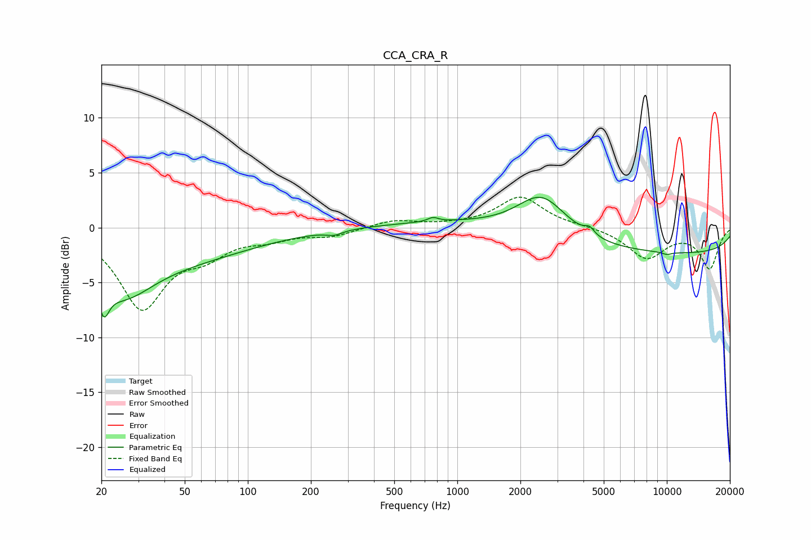

# CCA_CRA_R
See [usage instructions](https://github.com/jaakkopasanen/AutoEq#usage) for more options and info.

### Parametric EQs
Apply preamp of -2.9 dB when using parametric equalizer.

|   # | Type    |   Fc (Hz) |    Q |   Gain (dB) |
|-----|---------|-----------|------|-------------|
|   1 | Peaking |        21 | 5.7  |        -2.7 |
|   2 | Peaking |        25 | 0.92 |        -4.8 |
|   3 | Peaking |        54 | 0.44 |        -2.3 |
|   4 | Peaking |       259 | 3.72 |        -0.4 |
|   5 | Peaking |       765 | 5.84 |         0.4 |
|   6 | Peaking |      1000 | 0.43 |         0.6 |
|   7 | Peaking |      2532 | 1.2  |         3.8 |
|   8 | Peaking |      4273 | 6    |         0.6 |
|   9 | Peaking |     10000 | 0.18 |        -2.4 |
|  10 | Peaking |     10000 | 5.48 |        -0.2 |

### Fixed Band EQs
When using fixed band (also called graphic) equalizer, apply preamp of **-2.9 dB** (if available) and set gains manually with these parameters.

|   # | Type    |   Fc (Hz) |    Q |   Gain (dB) |
|-----|---------|-----------|------|-------------|
|   1 | Peaking |        31 | 1.41 |        -7.2 |
|   2 | Peaking |        62 | 1.41 |        -1.9 |
|   3 | Peaking |       125 | 1.41 |        -0.8 |
|   4 | Peaking |       250 | 1.41 |        -0.7 |
|   5 | Peaking |       500 | 1.41 |         0.7 |
|   6 | Peaking |      1000 | 1.41 |         0.1 |
|   7 | Peaking |      2000 | 1.41 |         2.8 |
|   8 | Peaking |      4000 | 1.41 |         0.1 |
|   9 | Peaking |      8000 | 1.41 |        -2.7 |
|  10 | Peaking |     16000 | 1.41 |        -3.7 |

### Graphs

