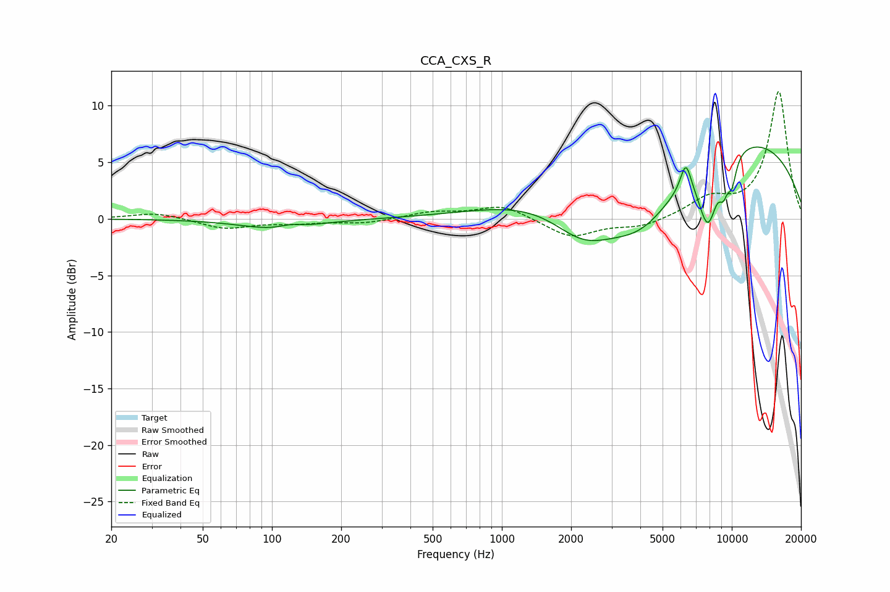

# CCA_CXS_R
See [usage instructions](https://github.com/jaakkopasanen/AutoEq#usage) for more options and info.

### Parametric EQs
Apply preamp of -6.4 dB when using parametric equalizer.

|   # | Type    |   Fc (Hz) |    Q |   Gain (dB) |
|-----|---------|-----------|------|-------------|
|   1 | Peaking |       106 | 0.92 |        -0.9 |
|   2 | Peaking |       120 | 2.89 |         0.3 |
|   3 | Peaking |      2266 | 0.96 |        -4.3 |
|   4 | Peaking |      4042 | 0.77 |        -6.7 |
|   5 | Peaking |      6311 | 5.84 |         2.6 |
|   6 | Peaking |      7370 | 0.19 |         8.4 |
|   7 | Peaking |      7881 | 3.04 |        -5.8 |
|   8 | Peaking |      9162 | 4.04 |         1.5 |
|   9 | Peaking |      9186 | 5.65 |        -3.2 |
|  10 | Peaking |     10000 | 5.97 |        -2.4 |

### Fixed Band EQs
When using fixed band (also called graphic) equalizer, apply preamp of **-11.3 dB** (if available) and set gains manually with these parameters.

|   # | Type    |   Fc (Hz) |    Q |   Gain (dB) |
|-----|---------|-----------|------|-------------|
|   1 | Peaking |        31 | 1.41 |         0.6 |
|   2 | Peaking |        62 | 1.41 |        -0.9 |
|   3 | Peaking |       125 | 1.41 |        -0.3 |
|   4 | Peaking |       250 | 1.41 |        -0.4 |
|   5 | Peaking |       500 | 1.41 |         0.6 |
|   6 | Peaking |      1000 | 1.41 |         1.2 |
|   7 | Peaking |      2000 | 1.41 |        -1.7 |
|   8 | Peaking |      4000 | 1.41 |        -0.7 |
|   9 | Peaking |      8000 | 1.41 |         1.6 |
|  10 | Peaking |     16000 | 1.41 |        11.3 |

### Graphs

