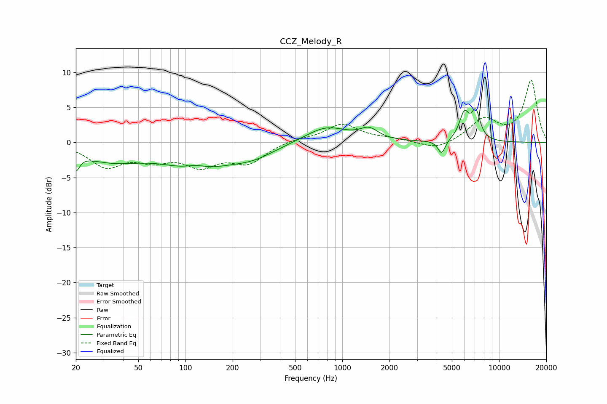

# CCZ_Melody_R
See [usage instructions](https://github.com/jaakkopasanen/AutoEq#usage) for more options and info.

### Parametric EQs
Apply preamp of -4.9 dB when using parametric equalizer.

|   # | Type    |   Fc (Hz) |    Q |   Gain (dB) |
|-----|---------|-----------|------|-------------|
|   1 | Peaking |        20 | 5.95 |        -2.3 |
|   2 | Peaking |        34 | 0.67 |        -2.4 |
|   3 | Peaking |       117 | 1.76 |         1.1 |
|   4 | Peaking |       119 | 0.76 |        -3.6 |
|   5 | Peaking |       267 | 0.95 |        -1.6 |
|   6 | Peaking |       789 | 1.05 |         2.3 |
|   7 | Peaking |      1484 | 2.45 |         1.5 |
|   8 | Peaking |      4297 | 5.99 |        -2   |
|   9 | Peaking |      6002 | 4.29 |         3.8 |
|  10 | Peaking |      7107 | 4.88 |         3.8 |

### Fixed Band EQs
When using fixed band (also called graphic) equalizer, apply preamp of **-9.0 dB** (if available) and set gains manually with these parameters.

|   # | Type    |   Fc (Hz) |    Q |   Gain (dB) |
|-----|---------|-----------|------|-------------|
|   1 | Peaking |        31 | 1.41 |        -3.2 |
|   2 | Peaking |        62 | 1.41 |        -2   |
|   3 | Peaking |       125 | 1.41 |        -2.9 |
|   4 | Peaking |       250 | 1.41 |        -2.7 |
|   5 | Peaking |       500 | 1.41 |         0.5 |
|   6 | Peaking |      1000 | 1.41 |         2.6 |
|   7 | Peaking |      2000 | 1.41 |         0.4 |
|   8 | Peaking |      4000 | 1.41 |        -1.2 |
|   9 | Peaking |      8000 | 1.41 |         3.2 |
|  10 | Peaking |     16000 | 1.41 |         8.8 |

### Graphs

