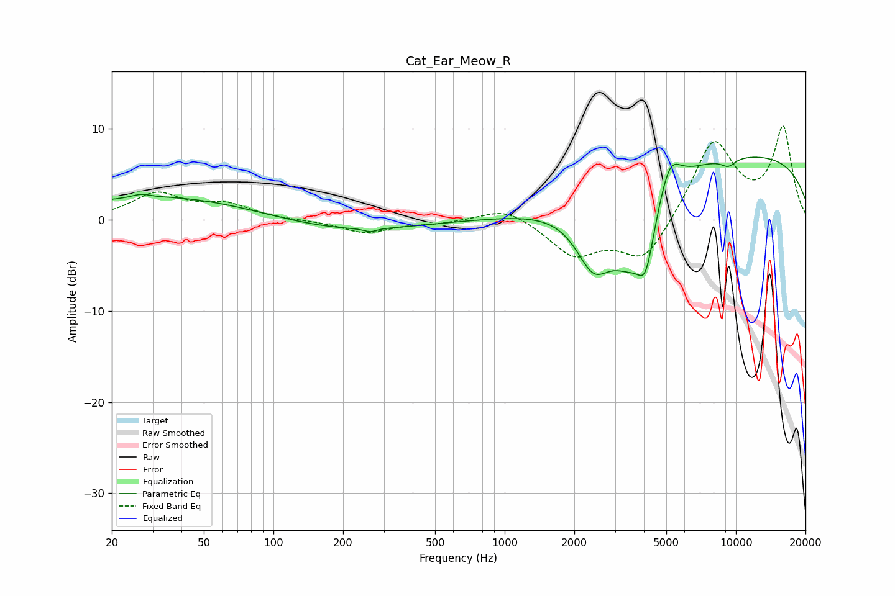

# Cat_Ear_Meow_R
See [usage instructions](https://github.com/jaakkopasanen/AutoEq#usage) for more options and info.

### Parametric EQs
Apply preamp of -6.9 dB when using parametric equalizer.

|   # | Type    |   Fc (Hz) |    Q |   Gain (dB) |
|-----|---------|-----------|------|-------------|
|   1 | Peaking |        27 | 4.1  |         0.4 |
|   2 | Peaking |        34 | 0.36 |         2.6 |
|   3 | Peaking |       201 | 0.47 |        -1.4 |
|   4 | Peaking |       262 | 5.69 |        -0.4 |
|   5 | Peaking |      2420 | 1.8  |        -6.2 |
|   6 | Peaking |      3507 | 1.41 |        -7.4 |
|   7 | Peaking |      4077 | 3.91 |        -5.1 |
|   8 | Peaking |      5178 | 2.93 |         3.8 |
|   9 | Peaking |      9264 | 3.98 |        -0.9 |
|  10 | Peaking |      9984 | 0.2  |         7.3 |

### Fixed Band EQs
When using fixed band (also called graphic) equalizer, apply preamp of **-10.4 dB** (if available) and set gains manually with these parameters.

|   # | Type    |   Fc (Hz) |    Q |   Gain (dB) |
|-----|---------|-----------|------|-------------|
|   1 | Peaking |        31 | 1.41 |         2.8 |
|   2 | Peaking |        62 | 1.41 |         1.5 |
|   3 | Peaking |       125 | 1.41 |        -0.1 |
|   4 | Peaking |       250 | 1.41 |        -1.4 |
|   5 | Peaking |       500 | 1.41 |        -0.3 |
|   6 | Peaking |      1000 | 1.41 |         1.5 |
|   7 | Peaking |      2000 | 1.41 |        -3.8 |
|   8 | Peaking |      4000 | 1.41 |        -4.7 |
|   9 | Peaking |      8000 | 1.41 |         8.7 |
|  10 | Peaking |     16000 | 1.41 |         9.9 |

### Graphs

