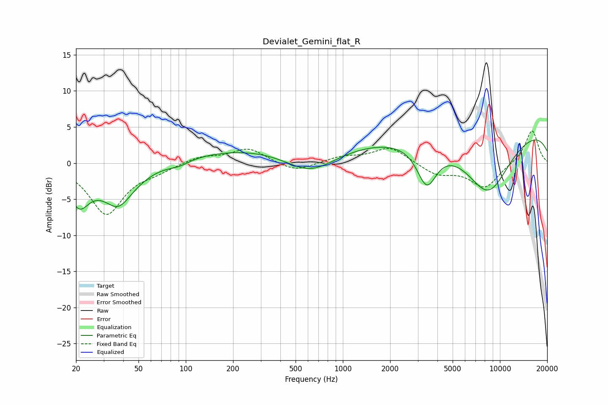

# Devialet_Gemini_flat_R
See [usage instructions](https://github.com/jaakkopasanen/AutoEq#usage) for more options and info.

### Parametric EQs
Apply preamp of -3.3 dB when using parametric equalizer.

|   # | Type    |   Fc (Hz) |    Q |   Gain (dB) |
|-----|---------|-----------|------|-------------|
|   1 | Peaking |        21 | 2.21 |        -4.7 |
|   2 | Peaking |        37 | 1.05 |        -4.1 |
|   3 | Peaking |        37 | 2.18 |        -1.6 |
|   4 | Peaking |        91 | 2.04 |        -0.7 |
|   5 | Peaking |       101 | 1.89 |         0.1 |
|   6 | Peaking |       498 | 0.2  |         2.5 |
|   7 | Peaking |       621 | 0.87 |        -3.5 |
|   8 | Peaking |      3422 | 2.21 |        -5.7 |
|   9 | Peaking |      8389 | 0.84 |        -8.8 |
|  10 | Peaking |     10000 | 0.18 |         5.2 |

### Fixed Band EQs
When using fixed band (also called graphic) equalizer, apply preamp of **-4.5 dB** (if available) and set gains manually with these parameters.

|   # | Type    |   Fc (Hz) |    Q |   Gain (dB) |
|-----|---------|-----------|------|-------------|
|   1 | Peaking |        31 | 1.41 |        -7   |
|   2 | Peaking |        62 | 1.41 |        -0.9 |
|   3 | Peaking |       125 | 1.41 |         0.9 |
|   4 | Peaking |       250 | 1.41 |         2   |
|   5 | Peaking |       500 | 1.41 |        -1.3 |
|   6 | Peaking |      1000 | 1.41 |         0.8 |
|   7 | Peaking |      2000 | 1.41 |         2.2 |
|   8 | Peaking |      4000 | 1.41 |        -1.6 |
|   9 | Peaking |      8000 | 1.41 |        -3.4 |
|  10 | Peaking |     16000 | 1.41 |         4.6 |

### Graphs

