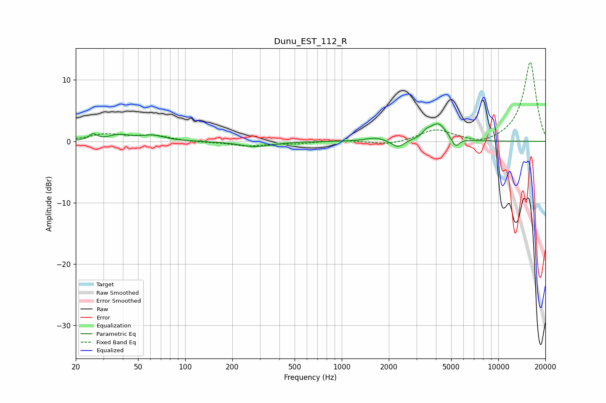

# Dunu_EST_112_R
See [usage instructions](https://github.com/jaakkopasanen/AutoEq#usage) for more options and info.

### Parametric EQs
Apply preamp of -2.9 dB when using parametric equalizer.

|   # | Type    |   Fc (Hz) |    Q |   Gain (dB) |
|-----|---------|-----------|------|-------------|
|   1 | Peaking |        26 | 6    |         1   |
|   2 | Peaking |        38 | 2.53 |         1.4 |
|   3 | Peaking |        39 | 3.85 |        -0.5 |
|   4 | Peaking |        62 | 1.85 |         0.9 |
|   5 | Peaking |       281 | 1.43 |        -0.9 |
|   6 | Peaking |      1647 | 2.38 |         0.6 |
|   7 | Peaking |      2288 | 3.6  |        -1.2 |
|   8 | Peaking |      3480 | 6    |         0.7 |
|   9 | Peaking |      4128 | 2.57 |         2.9 |
|  10 | Peaking |      5318 | 5.32 |        -1.6 |

### Fixed Band EQs
When using fixed band (also called graphic) equalizer, apply preamp of **-13.0 dB** (if available) and set gains manually with these parameters.

|   # | Type    |   Fc (Hz) |    Q |   Gain (dB) |
|-----|---------|-----------|------|-------------|
|   1 | Peaking |        31 | 1.41 |         1.1 |
|   2 | Peaking |        62 | 1.41 |         0.9 |
|   3 | Peaking |       125 | 1.41 |        -0.1 |
|   4 | Peaking |       250 | 1.41 |        -0.7 |
|   5 | Peaking |       500 | 1.41 |        -0.3 |
|   6 | Peaking |      1000 | 1.41 |         0.2 |
|   7 | Peaking |      2000 | 1.41 |        -0.6 |
|   8 | Peaking |      4000 | 1.41 |         1.9 |
|   9 | Peaking |      8000 | 1.41 |        -0.8 |
|  10 | Peaking |     16000 | 1.41 |        13   |

### Graphs

