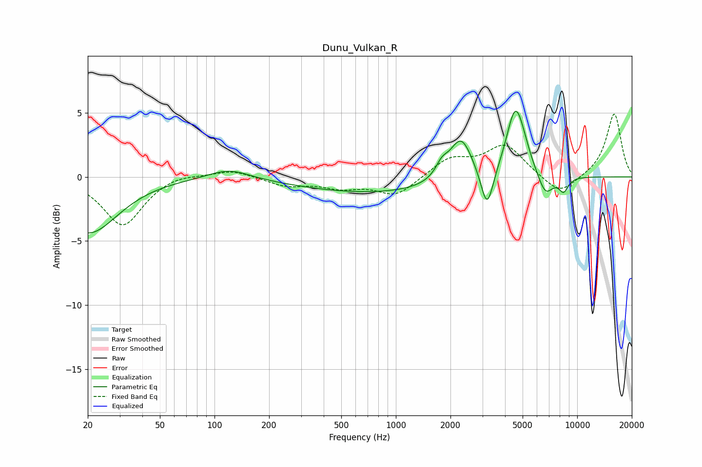

# Dunu_Vulkan_R
See [usage instructions](https://github.com/jaakkopasanen/AutoEq#usage) for more options and info.

### Parametric EQs
Apply preamp of -5.2 dB when using parametric equalizer.

|   # | Type    |   Fc (Hz) |    Q |   Gain (dB) |
|-----|---------|-----------|------|-------------|
|   1 | Peaking |        20 | 0.88 |        -4.4 |
|   2 | Peaking |       120 | 1.24 |         0.8 |
|   3 | Peaking |       794 | 0.33 |        -1.3 |
|   4 | Peaking |      1791 | 4.2  |         0.9 |
|   5 | Peaking |      2285 | 2.22 |         3.5 |
|   6 | Peaking |      3185 | 4.16 |        -3.3 |
|   7 | Peaking |      4547 | 2.84 |         5   |
|   8 | Peaking |      5009 | 3.01 |         0.8 |
|   9 | Peaking |      6674 | 3.23 |        -1.7 |
|  10 | Peaking |      8414 | 5.05 |        -1.1 |

### Fixed Band EQs
When using fixed band (also called graphic) equalizer, apply preamp of **-5.0 dB** (if available) and set gains manually with these parameters.

|   # | Type    |   Fc (Hz) |    Q |   Gain (dB) |
|-----|---------|-----------|------|-------------|
|   1 | Peaking |        31 | 1.41 |        -3.8 |
|   2 | Peaking |        62 | 1.41 |         0.4 |
|   3 | Peaking |       125 | 1.41 |         0.6 |
|   4 | Peaking |       250 | 1.41 |        -0.7 |
|   5 | Peaking |       500 | 1.41 |        -0.7 |
|   6 | Peaking |      1000 | 1.41 |        -1.5 |
|   7 | Peaking |      2000 | 1.41 |         1.4 |
|   8 | Peaking |      4000 | 1.41 |         2.4 |
|   9 | Peaking |      8000 | 1.41 |        -1.5 |
|  10 | Peaking |     16000 | 1.41 |         5   |

### Graphs

