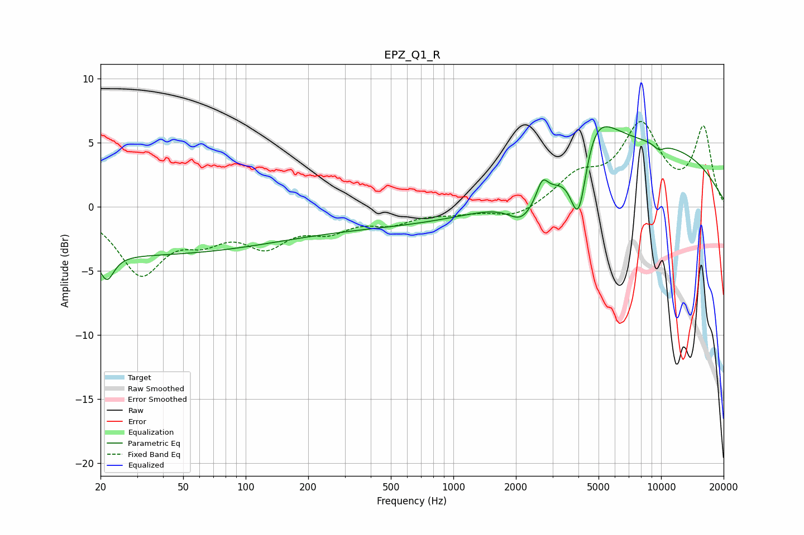

# EPZ_Q1_R
See [usage instructions](https://github.com/jaakkopasanen/AutoEq#usage) for more options and info.

### Parametric EQs
Apply preamp of -6.3 dB when using parametric equalizer.

|   # | Type    |   Fc (Hz) |    Q |   Gain (dB) |
|-----|---------|-----------|------|-------------|
|   1 | Peaking |        21 | 4.31 |        -2   |
|   2 | Peaking |        25 | 0.18 |        -3.7 |
|   3 | Peaking |       451 | 0.26 |        -1.4 |
|   4 | Peaking |      2135 | 2.21 |        -1.7 |
|   5 | Peaking |      2682 | 5.31 |         1.5 |
|   6 | Peaking |      2972 | 0.87 |        -1.9 |
|   7 | Peaking |      4014 | 3.25 |        -6.9 |
|   8 | Peaking |      4514 | 1.34 |         5.3 |
|   9 | Peaking |      8139 | 0.26 |         4.7 |
|  10 | Peaking |      9755 | 4.62 |        -0.5 |

### Fixed Band EQs
When using fixed band (also called graphic) equalizer, apply preamp of **-6.7 dB** (if available) and set gains manually with these parameters.

|   # | Type    |   Fc (Hz) |    Q |   Gain (dB) |
|-----|---------|-----------|------|-------------|
|   1 | Peaking |        31 | 1.41 |        -5   |
|   2 | Peaking |        62 | 1.41 |        -1.9 |
|   3 | Peaking |       125 | 1.41 |        -2.6 |
|   4 | Peaking |       250 | 1.41 |        -1.5 |
|   5 | Peaking |       500 | 1.41 |        -1.1 |
|   6 | Peaking |      1000 | 1.41 |        -0.4 |
|   7 | Peaking |      2000 | 1.41 |        -0.9 |
|   8 | Peaking |      4000 | 1.41 |         2.1 |
|   9 | Peaking |      8000 | 1.41 |         6   |
|  10 | Peaking |     16000 | 1.41 |         6   |

### Graphs

