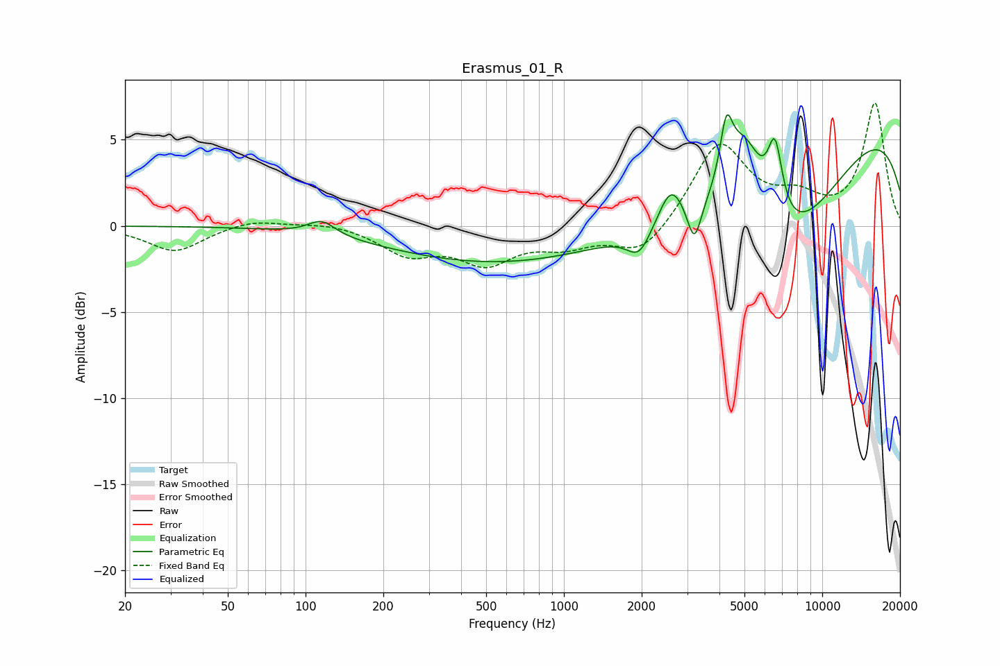

# Erasmus_01_R
See [usage instructions](https://github.com/jaakkopasanen/AutoEq#usage) for more options and info.

### Parametric EQs
Apply preamp of -6.6 dB when using parametric equalizer.

|   # | Type    |   Fc (Hz) |    Q |   Gain (dB) |
|-----|---------|-----------|------|-------------|
|   1 | Peaking |       115 | 2.65 |         0.9 |
|   2 | Peaking |      1122 | 0.18 |        -2.7 |
|   3 | Peaking |      1956 | 3.07 |        -1.5 |
|   4 | Peaking |      2600 | 2.85 |         2.4 |
|   5 | Peaking |      3199 | 5.44 |        -2.3 |
|   6 | Peaking |      4253 | 5.93 |         3.2 |
|   7 | Peaking |      4973 | 1.56 |         6.7 |
|   8 | Peaking |      6503 | 0.52 |        -8.5 |
|   9 | Peaking |      6566 | 4.73 |         4.1 |
|  10 | Peaking |      9262 | 0.18 |         7.4 |

### Fixed Band EQs
When using fixed band (also called graphic) equalizer, apply preamp of **-7.2 dB** (if available) and set gains manually with these parameters.

|   # | Type    |   Fc (Hz) |    Q |   Gain (dB) |
|-----|---------|-----------|------|-------------|
|   1 | Peaking |        31 | 1.41 |        -1.5 |
|   2 | Peaking |        62 | 1.41 |         0.4 |
|   3 | Peaking |       125 | 1.41 |         0.2 |
|   4 | Peaking |       250 | 1.41 |        -1.5 |
|   5 | Peaking |       500 | 1.41 |        -2   |
|   6 | Peaking |      1000 | 1.41 |        -1   |
|   7 | Peaking |      2000 | 1.41 |        -1.8 |
|   8 | Peaking |      4000 | 1.41 |         4.8 |
|   9 | Peaking |      8000 | 1.41 |         1.3 |
|  10 | Peaking |     16000 | 1.41 |         7.1 |

### Graphs

