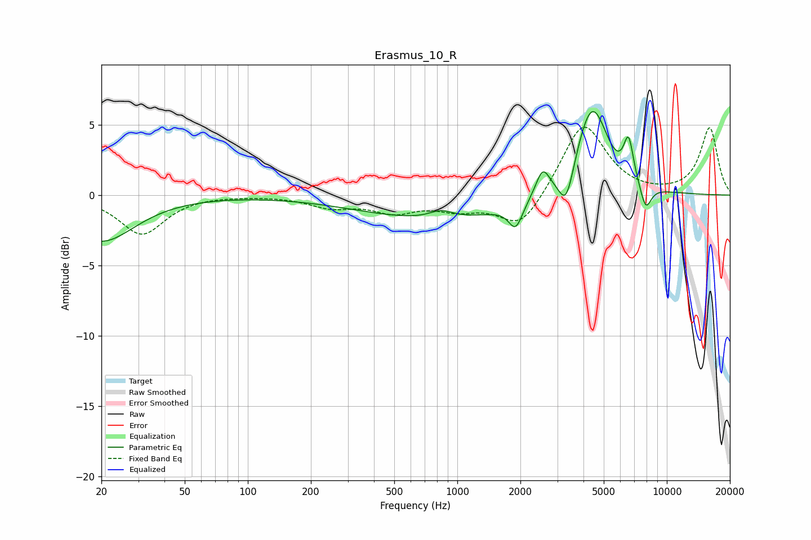

# Erasmus_10_R
See [usage instructions](https://github.com/jaakkopasanen/AutoEq#usage) for more options and info.

### Parametric EQs
Apply preamp of -6.0 dB when using parametric equalizer.

|   # | Type    |   Fc (Hz) |    Q |   Gain (dB) |
|-----|---------|-----------|------|-------------|
|   1 | Peaking |        20 | 0.89 |        -3.3 |
|   2 | Peaking |       837 | 2.47 |         0.6 |
|   3 | Peaking |       854 | 0.36 |        -1.8 |
|   4 | Peaking |      1899 | 4.35 |        -1.7 |
|   5 | Peaking |      2555 | 4.2  |         1.9 |
|   6 | Peaking |      3314 | 3.91 |        -2.7 |
|   7 | Peaking |      4389 | 1.74 |         6.7 |
|   8 | Peaking |      5636 | 3.23 |        -0.3 |
|   9 | Peaking |      6569 | 5.92 |         2.9 |
|  10 | Peaking |      7928 | 4.9  |        -1.8 |

### Fixed Band EQs
When using fixed band (also called graphic) equalizer, apply preamp of **-4.9 dB** (if available) and set gains manually with these parameters.

|   # | Type    |   Fc (Hz) |    Q |   Gain (dB) |
|-----|---------|-----------|------|-------------|
|   1 | Peaking |        31 | 1.41 |        -2.8 |
|   2 | Peaking |        62 | 1.41 |         0   |
|   3 | Peaking |       125 | 1.41 |         0   |
|   4 | Peaking |       250 | 1.41 |        -0.8 |
|   5 | Peaking |       500 | 1.41 |        -1.1 |
|   6 | Peaking |      1000 | 1.41 |        -0.9 |
|   7 | Peaking |      2000 | 1.41 |        -2.5 |
|   8 | Peaking |      4000 | 1.41 |         5.2 |
|   9 | Peaking |      8000 | 1.41 |        -0   |
|  10 | Peaking |     16000 | 1.41 |         4.8 |

### Graphs

