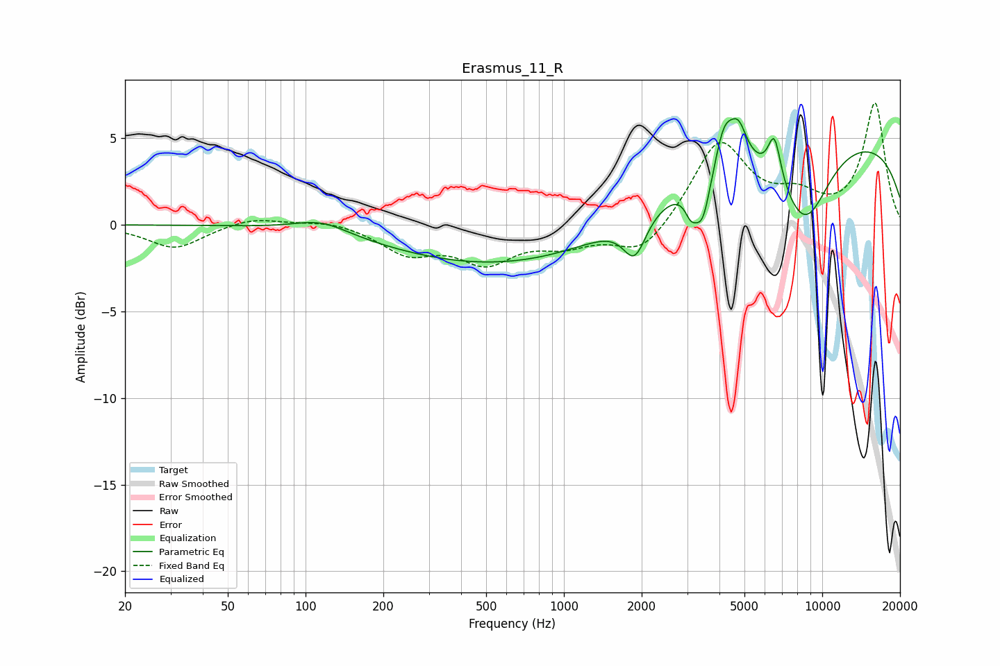

# Erasmus_11_R
See [usage instructions](https://github.com/jaakkopasanen/AutoEq#usage) for more options and info.

### Parametric EQs
Apply preamp of -6.2 dB when using parametric equalizer.

|   # | Type    |   Fc (Hz) |    Q |   Gain (dB) |
|-----|---------|-----------|------|-------------|
|   1 | Peaking |       115 | 1.33 |         0.8 |
|   2 | Peaking |       626 | 0.3  |        -2.4 |
|   3 | Peaking |      1879 | 3.17 |        -2.4 |
|   4 | Peaking |      3102 | 5.99 |        -1.2 |
|   5 | Peaking |      3442 | 4.49 |        -2.7 |
|   6 | Peaking |      4170 | 3.99 |         2.3 |
|   7 | Peaking |      4736 | 4.15 |         2   |
|   8 | Peaking |      6528 | 5.48 |         2.6 |
|   9 | Peaking |      8544 | 1.29 |        -4.8 |
|  10 | Peaking |      9793 | 0.2  |         5.3 |

### Fixed Band EQs
When using fixed band (also called graphic) equalizer, apply preamp of **-7.1 dB** (if available) and set gains manually with these parameters.

|   # | Type    |   Fc (Hz) |    Q |   Gain (dB) |
|-----|---------|-----------|------|-------------|
|   1 | Peaking |        31 | 1.41 |        -1.4 |
|   2 | Peaking |        62 | 1.41 |         0.5 |
|   3 | Peaking |       125 | 1.41 |         0.3 |
|   4 | Peaking |       250 | 1.41 |        -1.5 |
|   5 | Peaking |       500 | 1.41 |        -2   |
|   6 | Peaking |      1000 | 1.41 |        -1   |
|   7 | Peaking |      2000 | 1.41 |        -1.8 |
|   8 | Peaking |      4000 | 1.41 |         4.8 |
|   9 | Peaking |      8000 | 1.41 |         1.3 |
|  10 | Peaking |     16000 | 1.41 |         7   |

### Graphs

