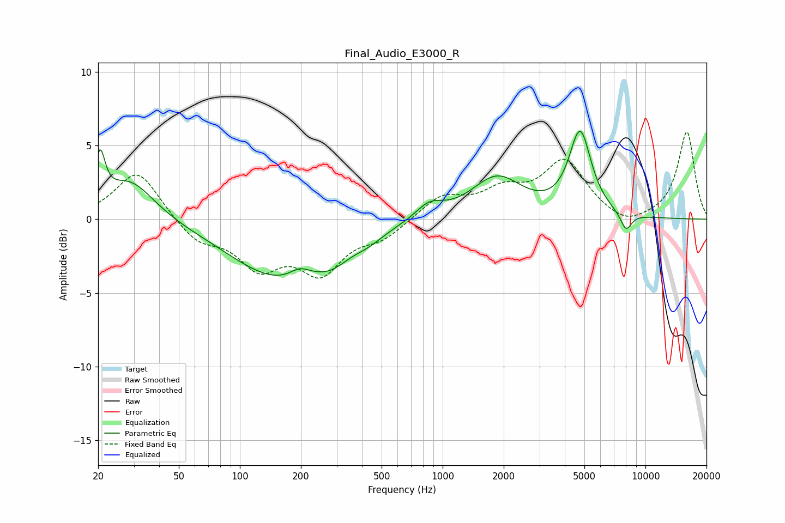

# Final_Audio_E3000_R
See [usage instructions](https://github.com/jaakkopasanen/AutoEq#usage) for more options and info.

### Parametric EQs
Apply preamp of -6.1 dB when using parametric equalizer.

|   # | Type    |   Fc (Hz) |    Q |   Gain (dB) |
|-----|---------|-----------|------|-------------|
|   1 | Peaking |        20 | 5.78 |         3.3 |
|   2 | Peaking |        29 | 1.19 |         2.7 |
|   3 | Peaking |       159 | 0.56 |        -3.9 |
|   4 | Peaking |       197 | 2.93 |         0.6 |
|   5 | Peaking |       284 | 1.66 |        -0.9 |
|   6 | Peaking |       432 | 2.1  |        -0.4 |
|   7 | Peaking |       859 | 2.09 |         1   |
|   8 | Peaking |      1850 | 1.12 |         2.8 |
|   9 | Peaking |      4763 | 2.58 |         5.6 |
|  10 | Peaking |      8017 | 4.68 |        -1.2 |

### Fixed Band EQs
When using fixed band (also called graphic) equalizer, apply preamp of **-6.0 dB** (if available) and set gains manually with these parameters.

|   # | Type    |   Fc (Hz) |    Q |   Gain (dB) |
|-----|---------|-----------|------|-------------|
|   1 | Peaking |        31 | 1.41 |         3.4 |
|   2 | Peaking |        62 | 1.41 |        -1.5 |
|   3 | Peaking |       125 | 1.41 |        -2.9 |
|   4 | Peaking |       250 | 1.41 |        -3.3 |
|   5 | Peaking |       500 | 1.41 |        -1.1 |
|   6 | Peaking |      1000 | 1.41 |         1.5 |
|   7 | Peaking |      2000 | 1.41 |         1.7 |
|   8 | Peaking |      4000 | 1.41 |         3.8 |
|   9 | Peaking |      8000 | 1.41 |        -0.7 |
|  10 | Peaking |     16000 | 1.41 |         5.9 |

### Graphs

