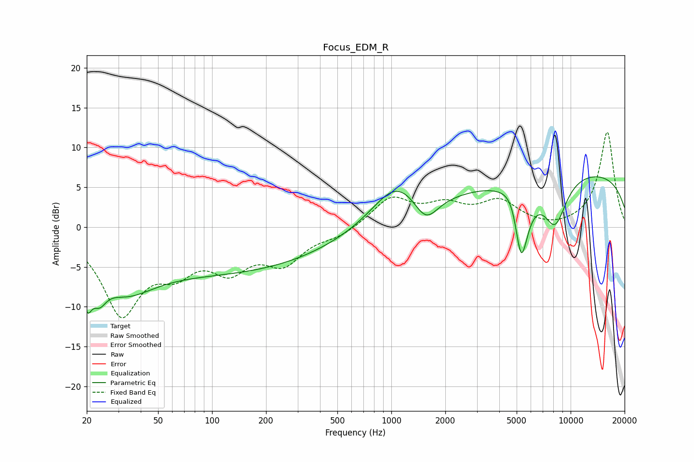

# Focus_EDM_R
See [usage instructions](https://github.com/jaakkopasanen/AutoEq#usage) for more options and info.

### Parametric EQs
Apply preamp of -6.4 dB when using parametric equalizer.

|   # | Type    |   Fc (Hz) |    Q |   Gain (dB) |
|-----|---------|-----------|------|-------------|
|   1 | Peaking |        20 | 5.28 |        -4.6 |
|   2 | Peaking |        24 | 3.59 |        -2.8 |
|   3 | Peaking |        32 | 0.86 |        -4.9 |
|   4 | Peaking |       119 | 0.24 |        -5.5 |
|   5 | Peaking |      1066 | 1.05 |         5   |
|   6 | Peaking |      1558 | 2.09 |        -3.3 |
|   7 | Peaking |      4890 | 2.56 |         3.6 |
|   8 | Peaking |      5285 | 3.18 |       -11.6 |
|   9 | Peaking |      8184 | 2.02 |        -6   |
|  10 | Peaking |      9871 | 0.18 |         7.2 |

### Fixed Band EQs
When using fixed band (also called graphic) equalizer, apply preamp of **-12.0 dB** (if available) and set gains manually with these parameters.

|   # | Type    |   Fc (Hz) |    Q |   Gain (dB) |
|-----|---------|-----------|------|-------------|
|   1 | Peaking |        31 | 1.41 |       -10.4 |
|   2 | Peaking |        62 | 1.41 |        -4   |
|   3 | Peaking |       125 | 1.41 |        -4.5 |
|   4 | Peaking |       250 | 1.41 |        -4   |
|   5 | Peaking |       500 | 1.41 |        -1   |
|   6 | Peaking |      1000 | 1.41 |         3.6 |
|   7 | Peaking |      2000 | 1.41 |         2.3 |
|   8 | Peaking |      4000 | 1.41 |         3   |
|   9 | Peaking |      8000 | 1.41 |        -0.3 |
|  10 | Peaking |     16000 | 1.41 |        12   |

### Graphs

