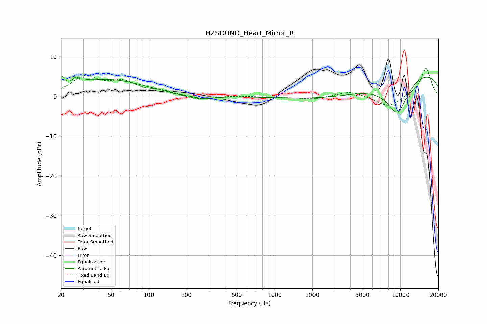

# HZSOUND_Heart_Mirror_R
See [usage instructions](https://github.com/jaakkopasanen/AutoEq#usage) for more options and info.

### Parametric EQs
Apply preamp of -5.2 dB when using parametric equalizer.

|   # | Type    |   Fc (Hz) |    Q |   Gain (dB) |
|-----|---------|-----------|------|-------------|
|   1 | Peaking |        20 | 5.99 |         2.8 |
|   2 | Peaking |        27 | 5.39 |         2.9 |
|   3 | Peaking |        28 | 5.97 |        -2.8 |
|   4 | Peaking |        29 | 4.23 |         1.4 |
|   5 | Peaking |        48 | 0.5  |         4.2 |
|   6 | Peaking |       169 | 2    |        -0.4 |
|   7 | Peaking |       273 | 1.78 |        -0.9 |
|   8 | Peaking |      3758 | 0.39 |        -4.4 |
|   9 | Peaking |      9475 | 1.39 |        -9   |
|  10 | Peaking |     10000 | 0.19 |         7.2 |

### Fixed Band EQs
When using fixed band (also called graphic) equalizer, apply preamp of **-7.1 dB** (if available) and set gains manually with these parameters.

|   # | Type    |   Fc (Hz) |    Q |   Gain (dB) |
|-----|---------|-----------|------|-------------|
|   1 | Peaking |        31 | 1.41 |         4.7 |
|   2 | Peaking |        62 | 1.41 |         3.1 |
|   3 | Peaking |       125 | 1.41 |         1.1 |
|   4 | Peaking |       250 | 1.41 |        -0.9 |
|   5 | Peaking |       500 | 1.41 |         0.2 |
|   6 | Peaking |      1000 | 1.41 |        -0.2 |
|   7 | Peaking |      2000 | 1.41 |        -0.7 |
|   8 | Peaking |      4000 | 1.41 |         1.4 |
|   9 | Peaking |      8000 | 1.41 |        -2.8 |
|  10 | Peaking |     16000 | 1.41 |         7.2 |

### Graphs

