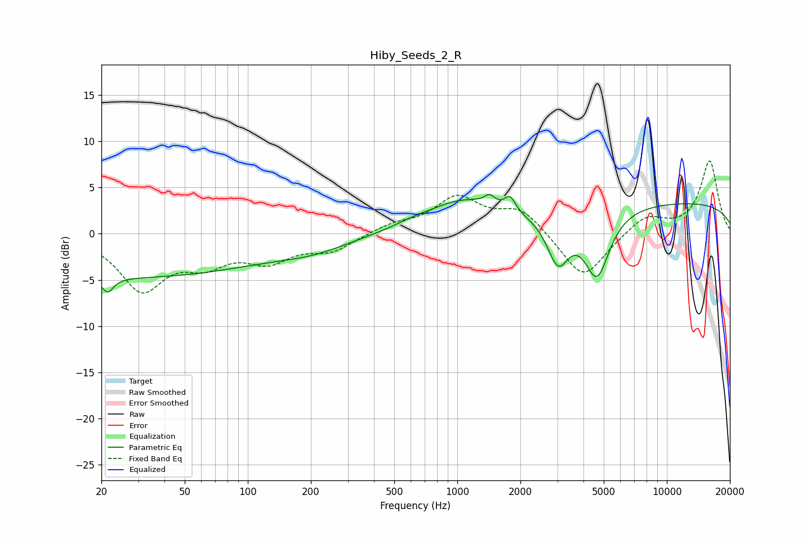

# Hiby_Seeds_2_R
See [usage instructions](https://github.com/jaakkopasanen/AutoEq#usage) for more options and info.

### Parametric EQs
Apply preamp of -4.3 dB when using parametric equalizer.

|   # | Type    |   Fc (Hz) |    Q |   Gain (dB) |
|-----|---------|-----------|------|-------------|
|   1 | Peaking |        21 | 5.2  |        -1.6 |
|   2 | Peaking |        25 | 0.18 |        -4.7 |
|   3 | Peaking |       207 | 0.82 |        -1.1 |
|   4 | Peaking |       605 | 1.79 |         0.3 |
|   5 | Peaking |      1054 | 0.79 |         3.1 |
|   6 | Peaking |      1425 | 5.85 |         0.9 |
|   7 | Peaking |      1786 | 5.56 |         1.5 |
|   8 | Peaking |      3024 | 2.67 |        -5.1 |
|   9 | Peaking |      4640 | 2.3  |        -7.1 |
|  10 | Peaking |     10000 | 0.18 |         3.4 |

### Fixed Band EQs
When using fixed band (also called graphic) equalizer, apply preamp of **-8.0 dB** (if available) and set gains manually with these parameters.

|   # | Type    |   Fc (Hz) |    Q |   Gain (dB) |
|-----|---------|-----------|------|-------------|
|   1 | Peaking |        31 | 1.41 |        -5.8 |
|   2 | Peaking |        62 | 1.41 |        -2.6 |
|   3 | Peaking |       125 | 1.41 |        -2.6 |
|   4 | Peaking |       250 | 1.41 |        -1.7 |
|   5 | Peaking |       500 | 1.41 |         0.9 |
|   6 | Peaking |      1000 | 1.41 |         3.7 |
|   7 | Peaking |      2000 | 1.41 |         2.6 |
|   8 | Peaking |      4000 | 1.41 |        -5.1 |
|   9 | Peaking |      8000 | 1.41 |         2   |
|  10 | Peaking |     16000 | 1.41 |         7.9 |

### Graphs

