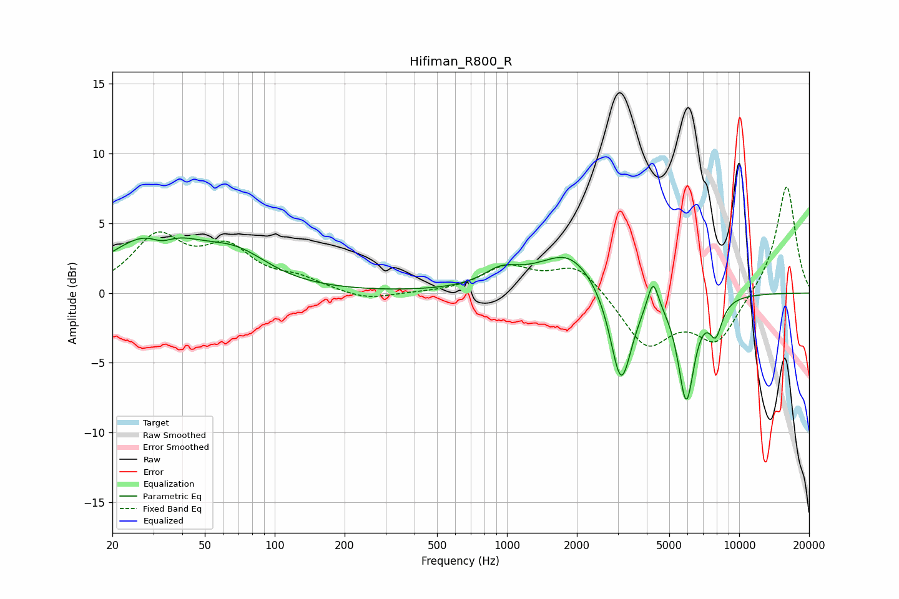

# Hifiman_R800_R
See [usage instructions](https://github.com/jaakkopasanen/AutoEq#usage) for more options and info.

### Parametric EQs
Apply preamp of -4.0 dB when using parametric equalizer.

|   # | Type    |   Fc (Hz) |    Q |   Gain (dB) |
|-----|---------|-----------|------|-------------|
|   1 | Peaking |        30 | 0.75 |         4.1 |
|   2 | Peaking |        33 | 2.81 |        -0.8 |
|   3 | Peaking |        69 | 1.02 |         1.9 |
|   4 | Peaking |       944 | 1.86 |         1.1 |
|   5 | Peaking |      1838 | 1.92 |         0.5 |
|   6 | Peaking |      1859 | 0.91 |         2.5 |
|   7 | Peaking |      3100 | 2.98 |        -7.2 |
|   8 | Peaking |      4256 | 6    |         2.2 |
|   9 | Peaking |      5916 | 3.91 |        -7.5 |
|  10 | Peaking |      7924 | 4.69 |        -2.3 |

### Fixed Band EQs
When using fixed band (also called graphic) equalizer, apply preamp of **-7.7 dB** (if available) and set gains manually with these parameters.

|   # | Type    |   Fc (Hz) |    Q |   Gain (dB) |
|-----|---------|-----------|------|-------------|
|   1 | Peaking |        31 | 1.41 |         3.8 |
|   2 | Peaking |        62 | 1.41 |         2.8 |
|   3 | Peaking |       125 | 1.41 |         0.8 |
|   4 | Peaking |       250 | 1.41 |        -0.6 |
|   5 | Peaking |       500 | 1.41 |        -0   |
|   6 | Peaking |      1000 | 1.41 |         1.8 |
|   7 | Peaking |      2000 | 1.41 |         2.1 |
|   8 | Peaking |      4000 | 1.41 |        -3.8 |
|   9 | Peaking |      8000 | 1.41 |        -3.4 |
|  10 | Peaking |     16000 | 1.41 |         7.8 |

### Graphs

