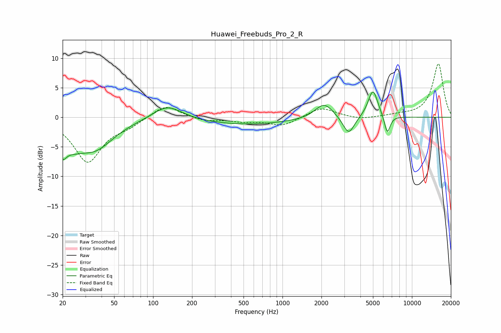

# Huawei_Freebuds_Pro_2_R
See [usage instructions](https://github.com/jaakkopasanen/AutoEq#usage) for more options and info.

### Parametric EQs
Apply preamp of -4.4 dB when using parametric equalizer.

|   # | Type    |   Fc (Hz) |    Q |   Gain (dB) |
|-----|---------|-----------|------|-------------|
|   1 | Peaking |        20 | 4.95 |        -6.4 |
|   2 | Peaking |        21 | 5.99 |         2.9 |
|   3 | Peaking |        24 | 1.97 |        -1.9 |
|   4 | Peaking |        35 | 0.95 |        -5.2 |
|   5 | Peaking |       129 | 1.27 |         2.4 |
|   6 | Peaking |       516 | 0.4  |        -1.2 |
|   7 | Peaking |      2098 | 2.03 |         2.6 |
|   8 | Peaking |      3244 | 3.21 |        -3.1 |
|   9 | Peaking |      4999 | 3.66 |         4.8 |
|  10 | Peaking |      6453 | 6    |        -3.2 |

### Fixed Band EQs
When using fixed band (also called graphic) equalizer, apply preamp of **-9.1 dB** (if available) and set gains manually with these parameters.

|   # | Type    |   Fc (Hz) |    Q |   Gain (dB) |
|-----|---------|-----------|------|-------------|
|   1 | Peaking |        31 | 1.41 |        -7.5 |
|   2 | Peaking |        62 | 1.41 |        -1.1 |
|   3 | Peaking |       125 | 1.41 |         2.3 |
|   4 | Peaking |       250 | 1.41 |        -0.6 |
|   5 | Peaking |       500 | 1.41 |        -0.6 |
|   6 | Peaking |      1000 | 1.41 |        -1.4 |
|   7 | Peaking |      2000 | 1.41 |         1.7 |
|   8 | Peaking |      4000 | 1.41 |        -0.4 |
|   9 | Peaking |      8000 | 1.41 |         0.3 |
|  10 | Peaking |     16000 | 1.41 |         9.1 |

### Graphs

