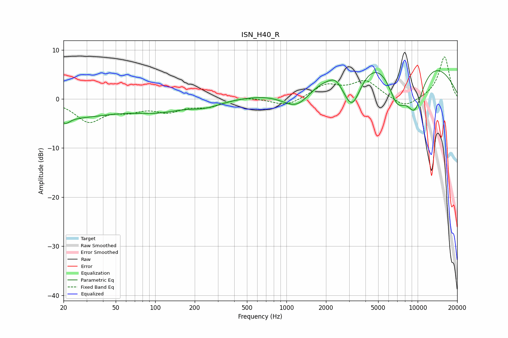

# ISN_H40_R
See [usage instructions](https://github.com/jaakkopasanen/AutoEq#usage) for more options and info.

### Parametric EQs
Apply preamp of -5.8 dB when using parametric equalizer.

|   # | Type    |   Fc (Hz) |    Q |   Gain (dB) |
|-----|---------|-----------|------|-------------|
|   1 | Peaking |        20 | 0.36 |        -3.7 |
|   2 | Peaking |        21 | 4.44 |        -1.2 |
|   3 | Peaking |       106 | 0.8  |        -1.8 |
|   4 | Peaking |       240 | 1.14 |        -1.3 |
|   5 | Peaking |      1209 | 1.15 |        -5.4 |
|   6 | Peaking |      2372 | 3.48 |         1.1 |
|   7 | Peaking |      3156 | 1.74 |       -10.1 |
|   8 | Peaking |      6134 | 0.24 |        13.4 |
|   9 | Peaking |      6967 | 1.68 |        -8.9 |
|  10 | Peaking |      9479 | 1.56 |       -10.7 |

### Fixed Band EQs
When using fixed band (also called graphic) equalizer, apply preamp of **-8.7 dB** (if available) and set gains manually with these parameters.

|   # | Type    |   Fc (Hz) |    Q |   Gain (dB) |
|-----|---------|-----------|------|-------------|
|   1 | Peaking |        31 | 1.41 |        -4.4 |
|   2 | Peaking |        62 | 1.41 |        -1.8 |
|   3 | Peaking |       125 | 1.41 |        -2.2 |
|   4 | Peaking |       250 | 1.41 |        -1.4 |
|   5 | Peaking |       500 | 1.41 |         0.5 |
|   6 | Peaking |      1000 | 1.41 |        -1.6 |
|   7 | Peaking |      2000 | 1.41 |         2.7 |
|   8 | Peaking |      4000 | 1.41 |         3.5 |
|   9 | Peaking |      8000 | 1.41 |        -2.1 |
|  10 | Peaking |     16000 | 1.41 |         8.7 |

### Graphs

