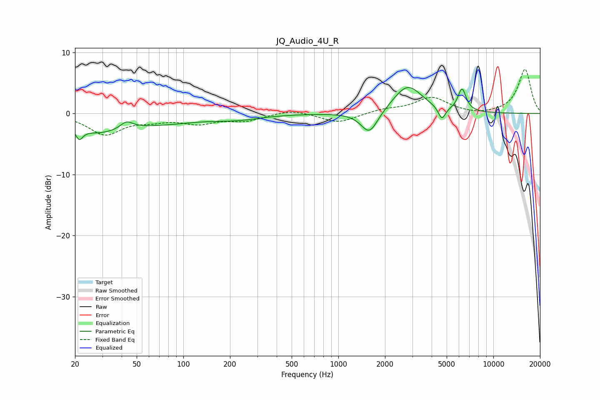

# JQ_Audio_4U_R
See [usage instructions](https://github.com/jaakkopasanen/AutoEq#usage) for more options and info.

### Parametric EQs
Apply preamp of -4.4 dB when using parametric equalizer.

|   # | Type    |   Fc (Hz) |    Q |   Gain (dB) |
|-----|---------|-----------|------|-------------|
|   1 | Peaking |        21 | 6    |        -4.1 |
|   2 | Peaking |        21 | 6    |         2.2 |
|   3 | Peaking |        28 | 0.86 |        -2.6 |
|   4 | Peaking |        43 | 3.58 |         1.2 |
|   5 | Peaking |        73 | 0.57 |        -1.3 |
|   6 | Peaking |       224 | 0.93 |        -0.7 |
|   7 | Peaking |      1588 | 2.55 |        -3.8 |
|   8 | Peaking |      2800 | 1.49 |         4.6 |
|   9 | Peaking |      4655 | 5.98 |        -2.1 |
|  10 | Peaking |      6280 | 5.21 |         3.7 |

### Fixed Band EQs
When using fixed band (also called graphic) equalizer, apply preamp of **-7.3 dB** (if available) and set gains manually with these parameters.

|   # | Type    |   Fc (Hz) |    Q |   Gain (dB) |
|-----|---------|-----------|------|-------------|
|   1 | Peaking |        31 | 1.41 |        -3.3 |
|   2 | Peaking |        62 | 1.41 |        -0.9 |
|   3 | Peaking |       125 | 1.41 |        -1.4 |
|   4 | Peaking |       250 | 1.41 |        -1.1 |
|   5 | Peaking |       500 | 1.41 |         0.7 |
|   6 | Peaking |      1000 | 1.41 |        -1.5 |
|   7 | Peaking |      2000 | 1.41 |         0.6 |
|   8 | Peaking |      4000 | 1.41 |         2.6 |
|   9 | Peaking |      8000 | 1.41 |        -0.3 |
|  10 | Peaking |     16000 | 1.41 |         7.3 |

### Graphs

