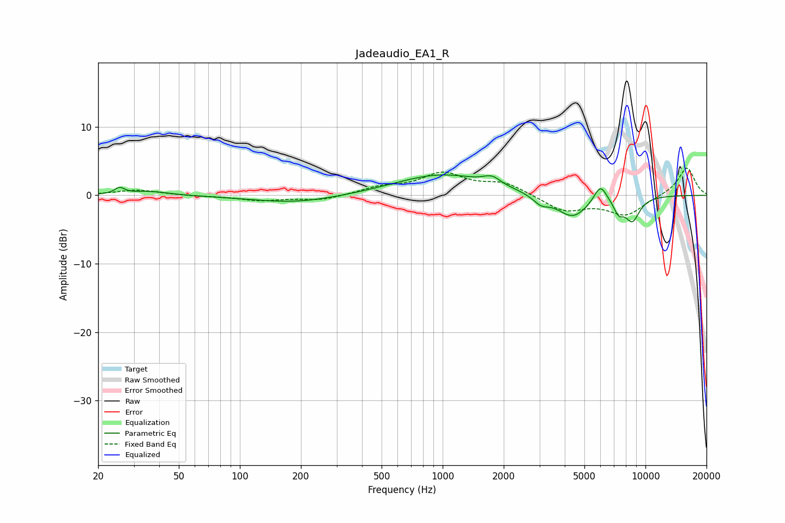

# Jadeaudio_EA1_R
See [usage instructions](https://github.com/jaakkopasanen/AutoEq#usage) for more options and info.

### Parametric EQs
Apply preamp of -3.1 dB when using parametric equalizer.

|   # | Type    |   Fc (Hz) |    Q |   Gain (dB) |
|-----|---------|-----------|------|-------------|
|   1 | Peaking |        26 | 5.95 |         0.9 |
|   2 | Peaking |        36 | 1.52 |         0.6 |
|   3 | Peaking |       189 | 0.65 |        -1.1 |
|   4 | Peaking |       984 | 0.62 |         3.1 |
|   5 | Peaking |      1750 | 3.3  |         1.2 |
|   6 | Peaking |      3055 | 3.55 |        -1.2 |
|   7 | Peaking |      4369 | 1.83 |        -3.3 |
|   8 | Peaking |      5995 | 4.35 |         2.6 |
|   9 | Peaking |      7374 | 5.37 |        -1.8 |
|  10 | Peaking |      8616 | 3.48 |        -3.5 |

### Fixed Band EQs
When using fixed band (also called graphic) equalizer, apply preamp of **-4.1 dB** (if available) and set gains manually with these parameters.

|   # | Type    |   Fc (Hz) |    Q |   Gain (dB) |
|-----|---------|-----------|------|-------------|
|   1 | Peaking |        31 | 1.41 |         0.8 |
|   2 | Peaking |        62 | 1.41 |        -0.1 |
|   3 | Peaking |       125 | 1.41 |        -0.7 |
|   4 | Peaking |       250 | 1.41 |        -0.7 |
|   5 | Peaking |       500 | 1.41 |         1   |
|   6 | Peaking |      1000 | 1.41 |         3   |
|   7 | Peaking |      2000 | 1.41 |         1.7 |
|   8 | Peaking |      4000 | 1.41 |        -2.3 |
|   9 | Peaking |      8000 | 1.41 |        -2.8 |
|  10 | Peaking |     16000 | 1.41 |         4.1 |

### Graphs

