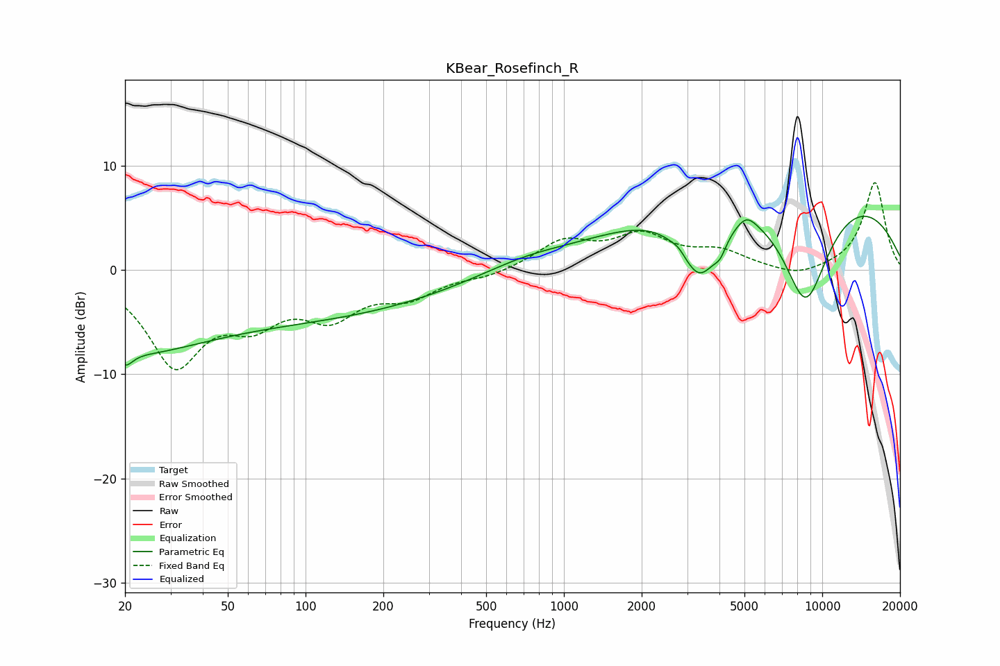

# KBear_Rosefinch_R
See [usage instructions](https://github.com/jaakkopasanen/AutoEq#usage) for more options and info.

### Parametric EQs
Apply preamp of -5.3 dB when using parametric equalizer.

|   # | Type    |   Fc (Hz) |    Q |   Gain (dB) |
|-----|---------|-----------|------|-------------|
|   1 | Peaking |        20 | 0.5  |        -6.4 |
|   2 | Peaking |        20 | 4.94 |        -1.4 |
|   3 | Peaking |       108 | 0.28 |        -4.2 |
|   4 | Peaking |       703 | 0.83 |         0.9 |
|   5 | Peaking |      2788 | 5.81 |         0.4 |
|   6 | Peaking |      3359 | 1.75 |        -7   |
|   7 | Peaking |      4028 | 5.92 |        -1.2 |
|   8 | Peaking |      5088 | 3.64 |         1.1 |
|   9 | Peaking |      7316 | 0.22 |         9.8 |
|  10 | Peaking |      8609 | 1.26 |       -12   |

### Fixed Band EQs
When using fixed band (also called graphic) equalizer, apply preamp of **-8.5 dB** (if available) and set gains manually with these parameters.

|   # | Type    |   Fc (Hz) |    Q |   Gain (dB) |
|-----|---------|-----------|------|-------------|
|   1 | Peaking |        31 | 1.41 |        -8.7 |
|   2 | Peaking |        62 | 1.41 |        -3.9 |
|   3 | Peaking |       125 | 1.41 |        -3.8 |
|   4 | Peaking |       250 | 1.41 |        -2.2 |
|   5 | Peaking |       500 | 1.41 |        -0.6 |
|   6 | Peaking |      1000 | 1.41 |         2.6 |
|   7 | Peaking |      2000 | 1.41 |         3   |
|   8 | Peaking |      4000 | 1.41 |         1.6 |
|   9 | Peaking |      8000 | 1.41 |        -0.8 |
|  10 | Peaking |     16000 | 1.41 |         8.5 |

### Graphs

