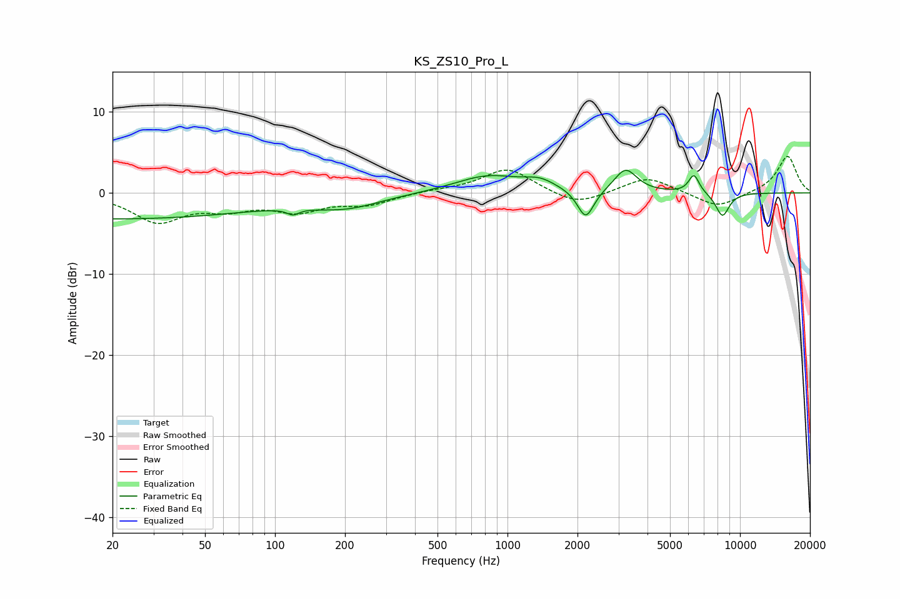

# KS_ZS10_Pro_L
See [usage instructions](https://github.com/jaakkopasanen/AutoEq#usage) for more options and info.

### Parametric EQs
Apply preamp of -2.9 dB when using parametric equalizer.

|   # | Type    |   Fc (Hz) |    Q |   Gain (dB) |
|-----|---------|-----------|------|-------------|
|   1 | Peaking |        20 | 0.2  |        -3.2 |
|   2 | Peaking |       119 | 6    |         1.8 |
|   3 | Peaking |       119 | 5.88 |        -2.6 |
|   4 | Peaking |       202 | 0.95 |        -1.5 |
|   5 | Peaking |       824 | 0.98 |         2.1 |
|   6 | Peaking |      1377 | 2.11 |         1.1 |
|   7 | Peaking |      2170 | 3.98 |        -3.7 |
|   8 | Peaking |      3220 | 2.95 |         2.9 |
|   9 | Peaking |      6338 | 6    |         2.3 |
|  10 | Peaking |      8404 | 4.43 |        -2.9 |

### Fixed Band EQs
When using fixed band (also called graphic) equalizer, apply preamp of **-4.6 dB** (if available) and set gains manually with these parameters.

|   # | Type    |   Fc (Hz) |    Q |   Gain (dB) |
|-----|---------|-----------|------|-------------|
|   1 | Peaking |        31 | 1.41 |        -3.4 |
|   2 | Peaking |        62 | 1.41 |        -1.6 |
|   3 | Peaking |       125 | 1.41 |        -2   |
|   4 | Peaking |       250 | 1.41 |        -1.3 |
|   5 | Peaking |       500 | 1.41 |         0.3 |
|   6 | Peaking |      1000 | 1.41 |         3.1 |
|   7 | Peaking |      2000 | 1.41 |        -1.6 |
|   8 | Peaking |      4000 | 1.41 |         2   |
|   9 | Peaking |      8000 | 1.41 |        -1.9 |
|  10 | Peaking |     16000 | 1.41 |         4.6 |

### Graphs

