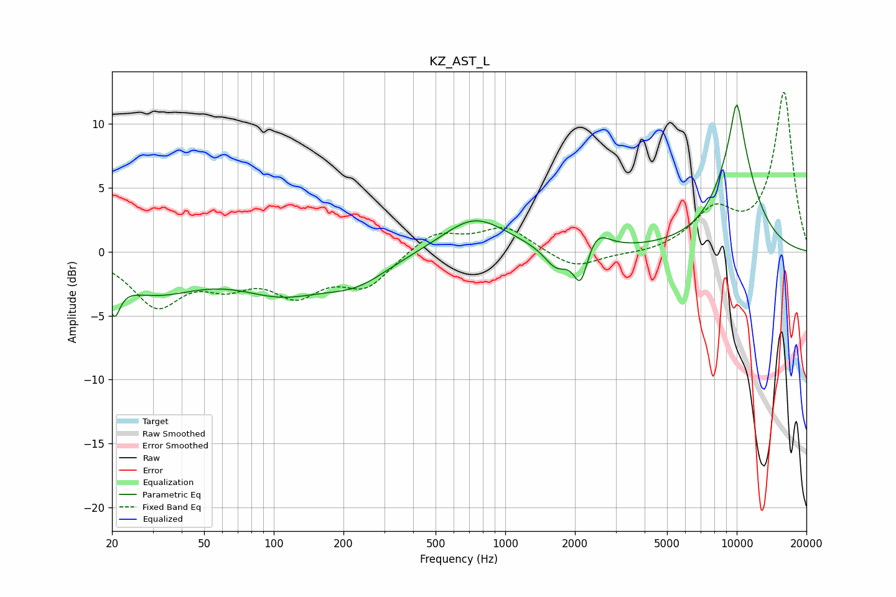

# KZ_AST_L
See [usage instructions](https://github.com/jaakkopasanen/AutoEq#usage) for more options and info.

### Parametric EQs
Apply preamp of -11.6 dB when using parametric equalizer.

|   # | Type    |   Fc (Hz) |    Q |   Gain (dB) |
|-----|---------|-----------|------|-------------|
|   1 | Peaking |        20 | 5.74 |        -2.7 |
|   2 | Peaking |        30 | 0.7  |        -2.9 |
|   3 | Peaking |       109 | 0.73 |        -2.7 |
|   4 | Peaking |       228 | 0.99 |        -1.8 |
|   5 | Peaking |       735 | 1.02 |         2.8 |
|   6 | Peaking |      1662 | 2.72 |        -1.7 |
|   7 | Peaking |      2120 | 4.53 |        -3.1 |
|   8 | Peaking |      2462 | 2.67 |         1.7 |
|   9 | Peaking |     10000 | 5.64 |         3.1 |
|  10 | Peaking |     10000 | 1.48 |         8.4 |

### Fixed Band EQs
When using fixed band (also called graphic) equalizer, apply preamp of **-12.6 dB** (if available) and set gains manually with these parameters.

|   # | Type    |   Fc (Hz) |    Q |   Gain (dB) |
|-----|---------|-----------|------|-------------|
|   1 | Peaking |        31 | 1.41 |        -4   |
|   2 | Peaking |        62 | 1.41 |        -2   |
|   3 | Peaking |       125 | 1.41 |        -2.9 |
|   4 | Peaking |       250 | 1.41 |        -2.5 |
|   5 | Peaking |       500 | 1.41 |         1.6 |
|   6 | Peaking |      1000 | 1.41 |         1.9 |
|   7 | Peaking |      2000 | 1.41 |        -1.4 |
|   8 | Peaking |      4000 | 1.41 |        -0.2 |
|   9 | Peaking |      8000 | 1.41 |         3   |
|  10 | Peaking |     16000 | 1.41 |        12.4 |

### Graphs

