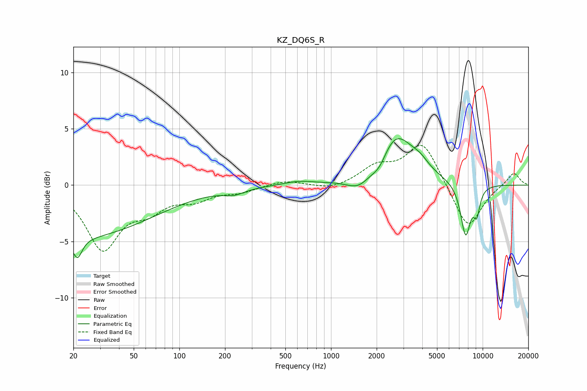

# KZ_DQ6S_R
See [usage instructions](https://github.com/jaakkopasanen/AutoEq#usage) for more options and info.

### Parametric EQs
Apply preamp of -4.2 dB when using parametric equalizer.

|   # | Type    |   Fc (Hz) |    Q |   Gain (dB) |
|-----|---------|-----------|------|-------------|
|   1 | Peaking |        20 | 0.26 |        -4.6 |
|   2 | Peaking |        21 | 4.7  |        -1.8 |
|   3 | Peaking |       229 | 2.09 |        -0.5 |
|   4 | Peaking |       608 | 1.5  |         0.3 |
|   5 | Peaking |      1543 | 1.65 |        -1.5 |
|   6 | Peaking |      2101 | 2.55 |        -1.5 |
|   7 | Peaking |      2615 | 1.1  |         4.9 |
|   8 | Peaking |      3888 | 2.65 |         0.6 |
|   9 | Peaking |      7722 | 3.93 |        -4.6 |
|  10 | Peaking |      9145 | 5.94 |        -2.1 |

### Fixed Band EQs
When using fixed band (also called graphic) equalizer, apply preamp of **-3.6 dB** (if available) and set gains manually with these parameters.

|   # | Type    |   Fc (Hz) |    Q |   Gain (dB) |
|-----|---------|-----------|------|-------------|
|   1 | Peaking |        31 | 1.41 |        -5.5 |
|   2 | Peaking |        62 | 1.41 |        -1.7 |
|   3 | Peaking |       125 | 1.41 |        -1.1 |
|   4 | Peaking |       250 | 1.41 |        -0.5 |
|   5 | Peaking |       500 | 1.41 |         0.4 |
|   6 | Peaking |      1000 | 1.41 |        -0.5 |
|   7 | Peaking |      2000 | 1.41 |         1.5 |
|   8 | Peaking |      4000 | 1.41 |         3.8 |
|   9 | Peaking |      8000 | 1.41 |        -4   |
|  10 | Peaking |     16000 | 1.41 |         1.2 |

### Graphs

