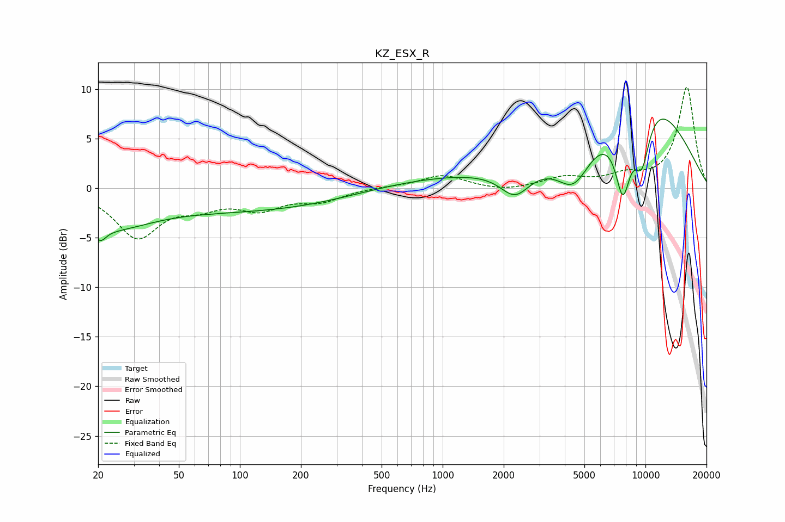

# KZ_ESX_R
See [usage instructions](https://github.com/jaakkopasanen/AutoEq#usage) for more options and info.

### Parametric EQs
Apply preamp of -7.1 dB when using parametric equalizer.

|   # | Type    |   Fc (Hz) |    Q |   Gain (dB) |
|-----|---------|-----------|------|-------------|
|   1 | Peaking |        20 | 5.02 |        -1.3 |
|   2 | Peaking |        22 | 0.66 |        -3.5 |
|   3 | Peaking |        70 | 5.92 |        -0   |
|   4 | Peaking |       127 | 0.29 |        -2.2 |
|   5 | Peaking |      1138 | 0.31 |         1.3 |
|   6 | Peaking |      2275 | 1.93 |        -2.7 |
|   7 | Peaking |      4434 | 1.7  |        -3.9 |
|   8 | Peaking |      7743 | 3.28 |        -7.3 |
|   9 | Peaking |      9584 | 2.92 |        -5.7 |
|  10 | Peaking |      9749 | 0.48 |         9.5 |

### Fixed Band EQs
When using fixed band (also called graphic) equalizer, apply preamp of **-10.3 dB** (if available) and set gains manually with these parameters.

|   # | Type    |   Fc (Hz) |    Q |   Gain (dB) |
|-----|---------|-----------|------|-------------|
|   1 | Peaking |        31 | 1.41 |        -4.8 |
|   2 | Peaking |        62 | 1.41 |        -1.4 |
|   3 | Peaking |       125 | 1.41 |        -1.9 |
|   4 | Peaking |       250 | 1.41 |        -1.2 |
|   5 | Peaking |       500 | 1.41 |         0.1 |
|   6 | Peaking |      1000 | 1.41 |         1.3 |
|   7 | Peaking |      2000 | 1.41 |        -0.4 |
|   8 | Peaking |      4000 | 1.41 |         1   |
|   9 | Peaking |      8000 | 1.41 |         1.1 |
|  10 | Peaking |     16000 | 1.41 |        10.2 |

### Graphs

