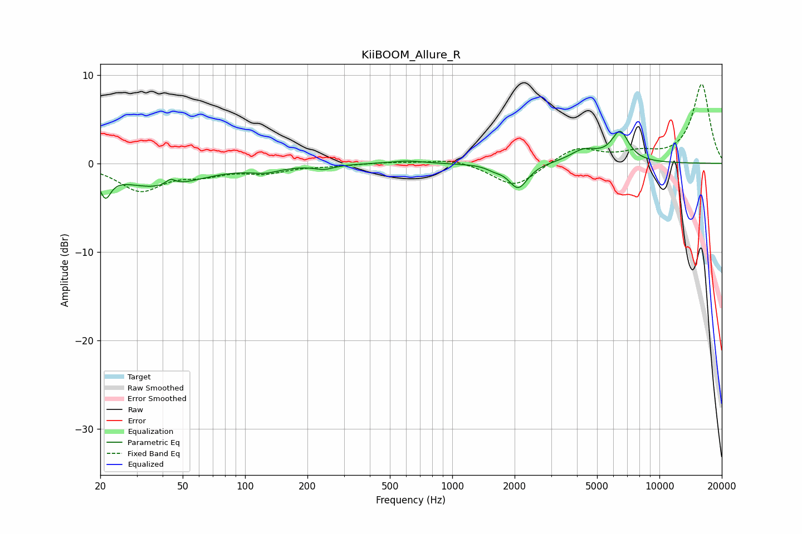

# KiiBOOM_Allure_R
See [usage instructions](https://github.com/jaakkopasanen/AutoEq#usage) for more options and info.

### Parametric EQs
Apply preamp of -3.7 dB when using parametric equalizer.

|   # | Type    |   Fc (Hz) |    Q |   Gain (dB) |
|-----|---------|-----------|------|-------------|
|   1 | Peaking |        21 | 5.5  |        -2.5 |
|   2 | Peaking |        38 | 0.72 |        -2.6 |
|   3 | Peaking |        44 | 6    |         0.7 |
|   4 | Peaking |       126 | 1.96 |        -0.6 |
|   5 | Peaking |       241 | 3    |        -0.5 |
|   6 | Peaking |       605 | 1.91 |         0.3 |
|   7 | Peaking |      1593 | 3.81 |        -0.4 |
|   8 | Peaking |      2082 | 3.1  |        -2.8 |
|   9 | Peaking |      4342 | 2.02 |         1.4 |
|  10 | Peaking |      6463 | 3.27 |         3.3 |

### Fixed Band EQs
When using fixed band (also called graphic) equalizer, apply preamp of **-9.0 dB** (if available) and set gains manually with these parameters.

|   # | Type    |   Fc (Hz) |    Q |   Gain (dB) |
|-----|---------|-----------|------|-------------|
|   1 | Peaking |        31 | 1.41 |        -3   |
|   2 | Peaking |        62 | 1.41 |        -1   |
|   3 | Peaking |       125 | 1.41 |        -0.9 |
|   4 | Peaking |       250 | 1.41 |        -0.2 |
|   5 | Peaking |       500 | 1.41 |         0.1 |
|   6 | Peaking |      1000 | 1.41 |         0.6 |
|   7 | Peaking |      2000 | 1.41 |        -2.7 |
|   8 | Peaking |      4000 | 1.41 |         1.8 |
|   9 | Peaking |      8000 | 1.41 |         1   |
|  10 | Peaking |     16000 | 1.41 |         8.9 |

### Graphs

