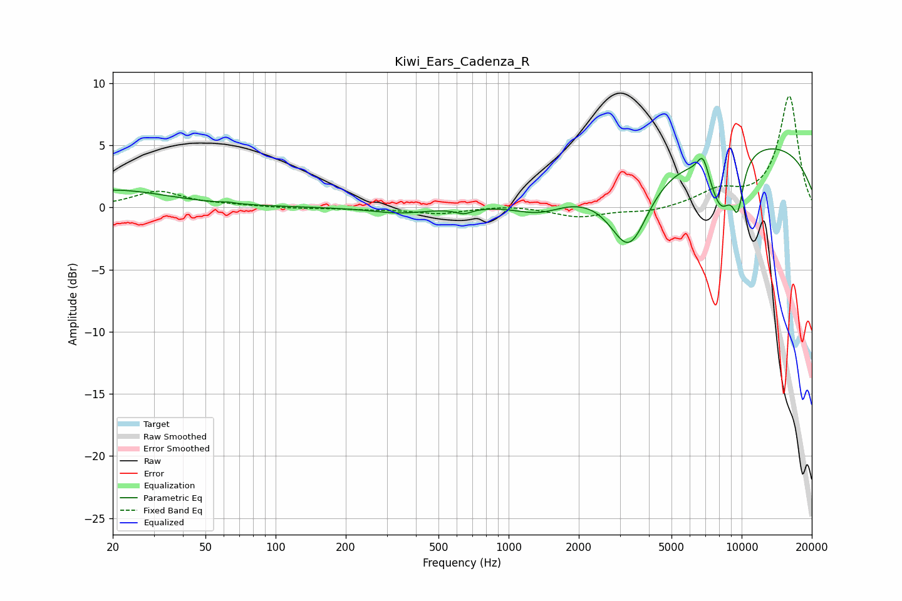

# Kiwi_Ears_Cadenza_R
See [usage instructions](https://github.com/jaakkopasanen/AutoEq#usage) for more options and info.

### Parametric EQs
Apply preamp of -4.8 dB when using parametric equalizer.

|   # | Type    |   Fc (Hz) |    Q |   Gain (dB) |
|-----|---------|-----------|------|-------------|
|   1 | Peaking |        20 | 0.61 |         1.4 |
|   2 | Peaking |        62 | 5.98 |         0.1 |
|   3 | Peaking |       341 | 1.17 |        -0.5 |
|   4 | Peaking |       642 | 4.07 |        -0.4 |
|   5 | Peaking |      1352 | 1.38 |        -1   |
|   6 | Peaking |      3297 | 1.65 |        -6   |
|   7 | Peaking |      6828 | 5.47 |         1.8 |
|   8 | Peaking |      8159 | 2.35 |        -4.5 |
|   9 | Peaking |      9625 | 5.19 |        -3.4 |
|  10 | Peaking |     10000 | 0.22 |         5.4 |

### Fixed Band EQs
When using fixed band (also called graphic) equalizer, apply preamp of **-9.0 dB** (if available) and set gains manually with these parameters.

|   # | Type    |   Fc (Hz) |    Q |   Gain (dB) |
|-----|---------|-----------|------|-------------|
|   1 | Peaking |        31 | 1.41 |         1.3 |
|   2 | Peaking |        62 | 1.41 |         0.1 |
|   3 | Peaking |       125 | 1.41 |        -0.1 |
|   4 | Peaking |       250 | 1.41 |        -0.1 |
|   5 | Peaking |       500 | 1.41 |        -0.5 |
|   6 | Peaking |      1000 | 1.41 |         0.2 |
|   7 | Peaking |      2000 | 1.41 |        -0.8 |
|   8 | Peaking |      4000 | 1.41 |        -0.4 |
|   9 | Peaking |      8000 | 1.41 |         1.2 |
|  10 | Peaking |     16000 | 1.41 |         8.9 |

### Graphs

