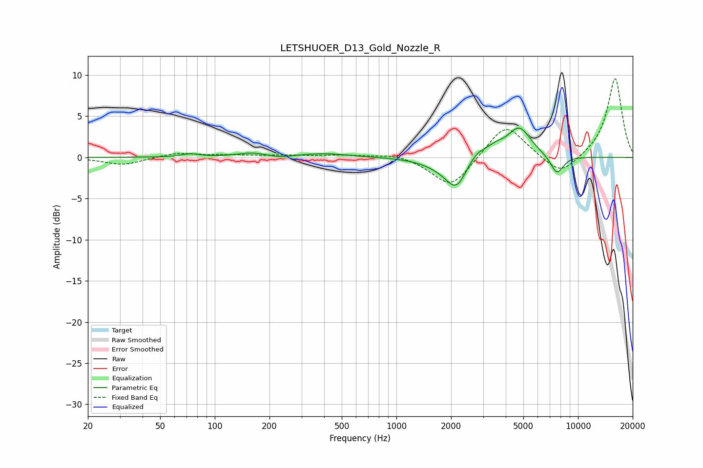

# LETSHUOER_D13_Gold_Nozzle_R
See [usage instructions](https://github.com/jaakkopasanen/AutoEq#usage) for more options and info.

### Parametric EQs
Apply preamp of -3.7 dB when using parametric equalizer.

|   # | Type    |   Fc (Hz) |    Q |   Gain (dB) |
|-----|---------|-----------|------|-------------|
|   1 | Peaking |        73 | 2.94 |         0.4 |
|   2 | Peaking |       161 | 1.65 |         0.5 |
|   3 | Peaking |       225 | 2.07 |        -0.3 |
|   4 | Peaking |       399 | 1.04 |         0.5 |
|   5 | Peaking |      1709 | 1.44 |        -0.7 |
|   6 | Peaking |      2143 | 2.34 |        -3.7 |
|   7 | Peaking |      2784 | 2.14 |         1.4 |
|   8 | Peaking |      3566 | 3.37 |         0.7 |
|   9 | Peaking |      4741 | 2.12 |         3.6 |
|  10 | Peaking |      7655 | 3.67 |        -2.3 |

### Fixed Band EQs
When using fixed band (also called graphic) equalizer, apply preamp of **-9.6 dB** (if available) and set gains manually with these parameters.

|   # | Type    |   Fc (Hz) |    Q |   Gain (dB) |
|-----|---------|-----------|------|-------------|
|   1 | Peaking |        31 | 1.41 |        -0.9 |
|   2 | Peaking |        62 | 1.41 |         0.6 |
|   3 | Peaking |       125 | 1.41 |         0.2 |
|   4 | Peaking |       250 | 1.41 |         0.2 |
|   5 | Peaking |       500 | 1.41 |         0.3 |
|   6 | Peaking |      1000 | 1.41 |         0.5 |
|   7 | Peaking |      2000 | 1.41 |        -3.8 |
|   8 | Peaking |      4000 | 1.41 |         4.2 |
|   9 | Peaking |      8000 | 1.41 |        -2.4 |
|  10 | Peaking |     16000 | 1.41 |         9.7 |

### Graphs

