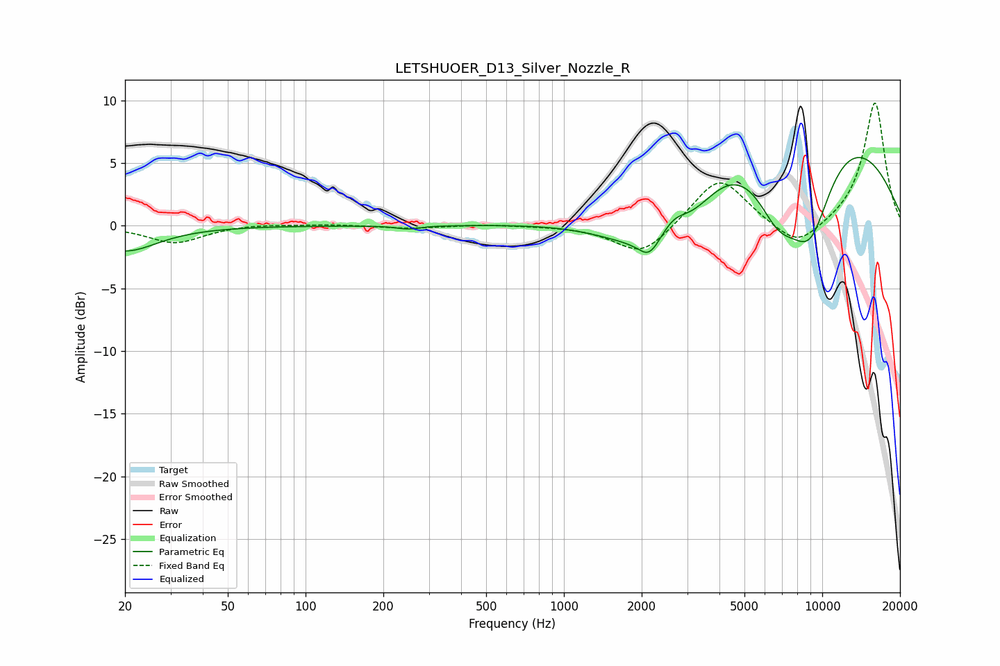

# LETSHUOER_D13_Silver_Nozzle_R
See [usage instructions](https://github.com/jaakkopasanen/AutoEq#usage) for more options and info.

### Parametric EQs
Apply preamp of -5.5 dB when using parametric equalizer.

|   # | Type    |   Fc (Hz) |    Q |   Gain (dB) |
|-----|---------|-----------|------|-------------|
|   1 | Peaking |        20 | 1.14 |        -2   |
|   2 | Peaking |       250 | 3.31 |        -0.3 |
|   3 | Peaking |      2035 | 0.72 |        -4.9 |
|   4 | Peaking |      2047 | 3.55 |         0.3 |
|   5 | Peaking |      2130 | 3.23 |        -2   |
|   6 | Peaking |      2669 | 2.95 |         0.9 |
|   7 | Peaking |      3156 | 1.37 |        -2   |
|   8 | Peaking |      6741 | 1.41 |        -5.7 |
|   9 | Peaking |      7385 | 0.26 |        10.3 |
|  10 | Peaking |      8978 | 1.37 |        -7.9 |

### Fixed Band EQs
When using fixed band (also called graphic) equalizer, apply preamp of **-9.9 dB** (if available) and set gains manually with these parameters.

|   # | Type    |   Fc (Hz) |    Q |   Gain (dB) |
|-----|---------|-----------|------|-------------|
|   1 | Peaking |        31 | 1.41 |        -1.4 |
|   2 | Peaking |        62 | 1.41 |         0.2 |
|   3 | Peaking |       125 | 1.41 |         0.1 |
|   4 | Peaking |       250 | 1.41 |        -0.2 |
|   5 | Peaking |       500 | 1.41 |         0.1 |
|   6 | Peaking |      1000 | 1.41 |        -0   |
|   7 | Peaking |      2000 | 1.41 |        -2.5 |
|   8 | Peaking |      4000 | 1.41 |         4   |
|   9 | Peaking |      8000 | 1.41 |        -2   |
|  10 | Peaking |     16000 | 1.41 |         9.9 |

### Graphs

