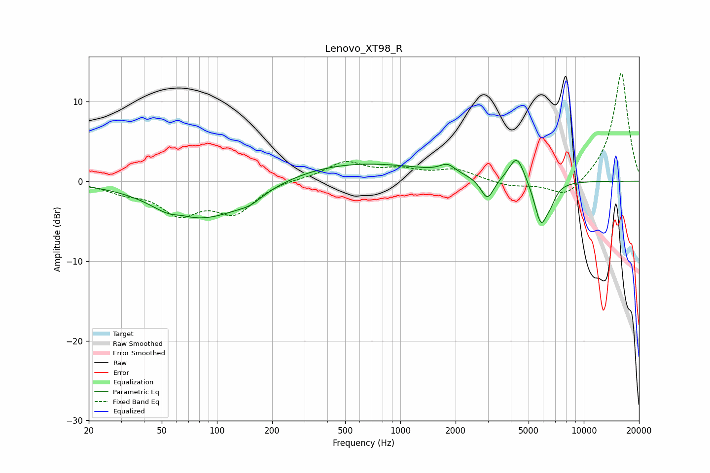

# Lenovo_XT98_R
See [usage instructions](https://github.com/jaakkopasanen/AutoEq#usage) for more options and info.

### Parametric EQs
Apply preamp of -2.7 dB when using parametric equalizer.

|   # | Type    |   Fc (Hz) |    Q |   Gain (dB) |
|-----|---------|-----------|------|-------------|
|   1 | Peaking |        57 | 1.52 |        -1.2 |
|   2 | Peaking |        63 | 2.68 |         0.5 |
|   3 | Peaking |        89 | 0.57 |        -4.7 |
|   4 | Peaking |       152 | 2.19 |        -0.8 |
|   5 | Peaking |       537 | 0.34 |         2.4 |
|   6 | Peaking |      1808 | 3.4  |         1.1 |
|   7 | Peaking |      2979 | 3.92 |        -2.8 |
|   8 | Peaking |      4316 | 3.34 |         3.4 |
|   9 | Peaking |      5841 | 3.75 |        -5.4 |
|  10 | Peaking |      6605 | 4.87 |        -1.2 |

### Fixed Band EQs
When using fixed band (also called graphic) equalizer, apply preamp of **-13.6 dB** (if available) and set gains manually with these parameters.

|   # | Type    |   Fc (Hz) |    Q |   Gain (dB) |
|-----|---------|-----------|------|-------------|
|   1 | Peaking |        31 | 1.41 |        -1.1 |
|   2 | Peaking |        62 | 1.41 |        -3.7 |
|   3 | Peaking |       125 | 1.41 |        -3.7 |
|   4 | Peaking |       250 | 1.41 |         0.2 |
|   5 | Peaking |       500 | 1.41 |         2.3 |
|   6 | Peaking |      1000 | 1.41 |         1.2 |
|   7 | Peaking |      2000 | 1.41 |         1.4 |
|   8 | Peaking |      4000 | 1.41 |        -0.7 |
|   9 | Peaking |      8000 | 1.41 |        -2.2 |
|  10 | Peaking |     16000 | 1.41 |        13.8 |

### Graphs

