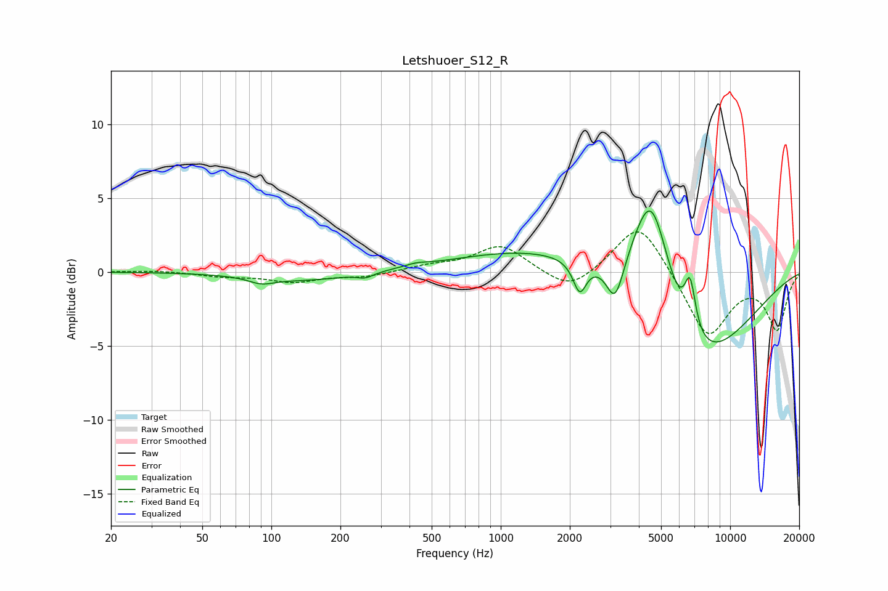

# Letshuoer_S12_R
See [usage instructions](https://github.com/jaakkopasanen/AutoEq#usage) for more options and info.

### Parametric EQs
Apply preamp of -4.2 dB when using parametric equalizer.

|   # | Type    |   Fc (Hz) |    Q |   Gain (dB) |
|-----|---------|-----------|------|-------------|
|   1 | Peaking |        91 | 2.67 |        -0.4 |
|   2 | Peaking |       139 | 0.67 |        -0.6 |
|   3 | Peaking |       257 | 3.96 |        -0.3 |
|   4 | Peaking |       428 | 2.87 |         0.2 |
|   5 | Peaking |      2210 | 4.89 |        -2.1 |
|   6 | Peaking |      2301 | 0.29 |         2.2 |
|   7 | Peaking |      3154 | 3.69 |        -2.9 |
|   8 | Peaking |      4539 | 1.56 |         9   |
|   9 | Peaking |      6653 | 0.56 |        -8.3 |
|  10 | Peaking |      6689 | 5.6  |         3.4 |

### Fixed Band EQs
When using fixed band (also called graphic) equalizer, apply preamp of **-2.8 dB** (if available) and set gains manually with these parameters.

|   # | Type    |   Fc (Hz) |    Q |   Gain (dB) |
|-----|---------|-----------|------|-------------|
|   1 | Peaking |        31 | 1.41 |         0.1 |
|   2 | Peaking |        62 | 1.41 |        -0.3 |
|   3 | Peaking |       125 | 1.41 |        -0.6 |
|   4 | Peaking |       250 | 1.41 |        -0.3 |
|   5 | Peaking |       500 | 1.41 |         0.4 |
|   6 | Peaking |      1000 | 1.41 |         1.8 |
|   7 | Peaking |      2000 | 1.41 |        -1.4 |
|   8 | Peaking |      4000 | 1.41 |         3.6 |
|   9 | Peaking |      8000 | 1.41 |        -4.4 |
|  10 | Peaking |     16000 | 1.41 |        -3.8 |

### Graphs

