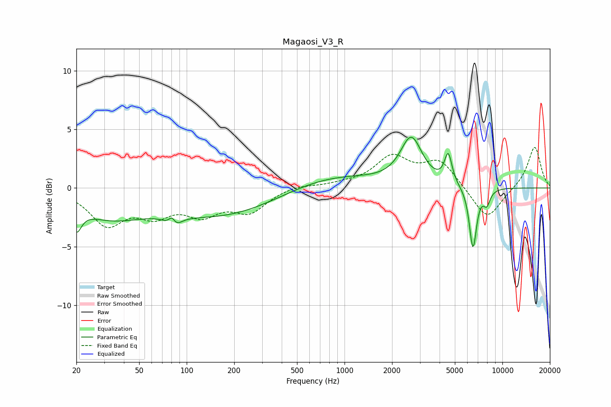

# Magaosi_V3_R
See [usage instructions](https://github.com/jaakkopasanen/AutoEq#usage) for more options and info.

### Parametric EQs
Apply preamp of -4.4 dB when using parametric equalizer.

|   # | Type    |   Fc (Hz) |    Q |   Gain (dB) |
|-----|---------|-----------|------|-------------|
|   1 | Peaking |        20 | 4.49 |        -2   |
|   2 | Peaking |        33 | 0.65 |        -2.2 |
|   3 | Peaking |        81 | 5.66 |         2.2 |
|   4 | Peaking |        82 | 4.2  |        -2.4 |
|   5 | Peaking |       171 | 0.39 |        -2.4 |
|   6 | Peaking |       790 | 0.47 |         1.3 |
|   7 | Peaking |      2647 | 2.08 |         4   |
|   8 | Peaking |      4539 | 6    |         2.5 |
|   9 | Peaking |      6510 | 5.89 |        -5.3 |
|  10 | Peaking |      7961 | 6    |        -1.2 |

### Fixed Band EQs
When using fixed band (also called graphic) equalizer, apply preamp of **-3.6 dB** (if available) and set gains manually with these parameters.

|   # | Type    |   Fc (Hz) |    Q |   Gain (dB) |
|-----|---------|-----------|------|-------------|
|   1 | Peaking |        31 | 1.41 |        -2.9 |
|   2 | Peaking |        62 | 1.41 |        -1.9 |
|   3 | Peaking |       125 | 1.41 |        -1.9 |
|   4 | Peaking |       250 | 1.41 |        -1.9 |
|   5 | Peaking |       500 | 1.41 |         0.3 |
|   6 | Peaking |      1000 | 1.41 |         0.2 |
|   7 | Peaking |      2000 | 1.41 |         2.5 |
|   8 | Peaking |      4000 | 1.41 |         2.2 |
|   9 | Peaking |      8000 | 1.41 |        -2.8 |
|  10 | Peaking |     16000 | 1.41 |         3.6 |

### Graphs

