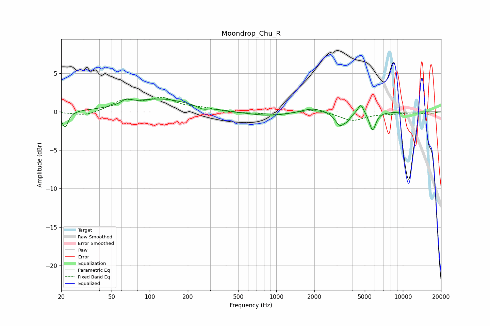

# Moondrop_Chu_R
See [usage instructions](https://github.com/jaakkopasanen/AutoEq#usage) for more options and info.

### Parametric EQs
Apply preamp of -1.8 dB when using parametric equalizer.

|   # | Type    |   Fc (Hz) |    Q |   Gain (dB) |
|-----|---------|-----------|------|-------------|
|   1 | Peaking |        21 | 5.82 |        -2.1 |
|   2 | Peaking |        65 | 3.87 |         0.6 |
|   3 | Peaking |       120 | 0.58 |         1.7 |
|   4 | Peaking |       262 | 3.71 |        -0.4 |
|   5 | Peaking |       870 | 0.74 |        -0.6 |
|   6 | Peaking |      1935 | 1.54 |         0.7 |
|   7 | Peaking |      3182 | 3.68 |        -1.7 |
|   8 | Peaking |      3643 | 6    |        -0.6 |
|   9 | Peaking |      4650 | 5.98 |         1.3 |
|  10 | Peaking |      5765 | 5.58 |        -2.4 |

### Fixed Band EQs
When using fixed band (also called graphic) equalizer, apply preamp of **-2.0 dB** (if available) and set gains manually with these parameters.

|   # | Type    |   Fc (Hz) |    Q |   Gain (dB) |
|-----|---------|-----------|------|-------------|
|   1 | Peaking |        31 | 1.41 |        -0.6 |
|   2 | Peaking |        62 | 1.41 |         1.4 |
|   3 | Peaking |       125 | 1.41 |         1.6 |
|   4 | Peaking |       250 | 1.41 |         0.4 |
|   5 | Peaking |       500 | 1.41 |        -0.2 |
|   6 | Peaking |      1000 | 1.41 |        -0.4 |
|   7 | Peaking |      2000 | 1.41 |         0.4 |
|   8 | Peaking |      4000 | 1.41 |        -1.1 |
|   9 | Peaking |      8000 | 1.41 |        -0.2 |
|  10 | Peaking |     16000 | 1.41 |        -0.3 |

### Graphs

